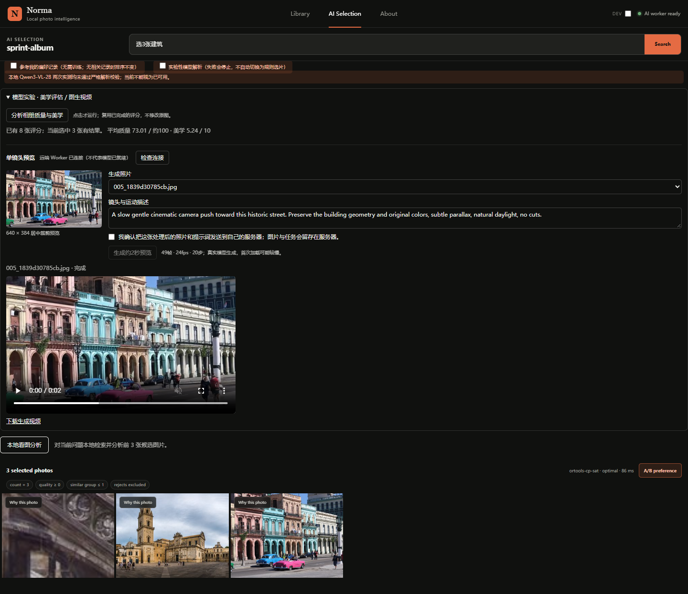
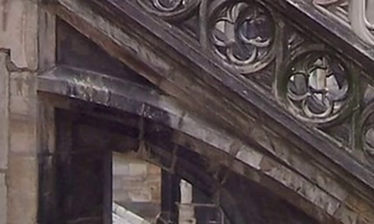
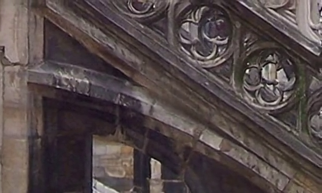
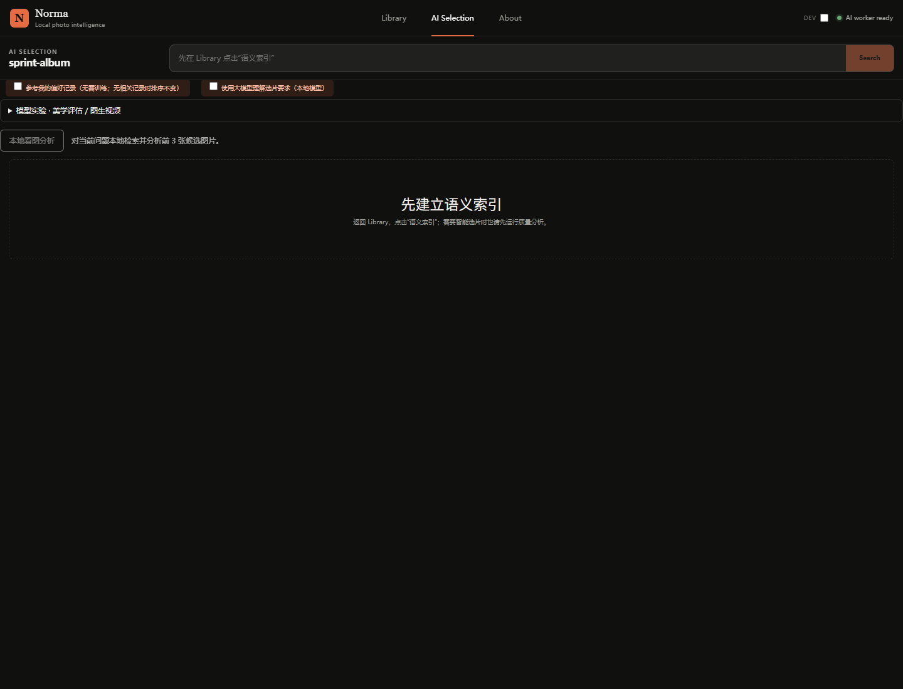
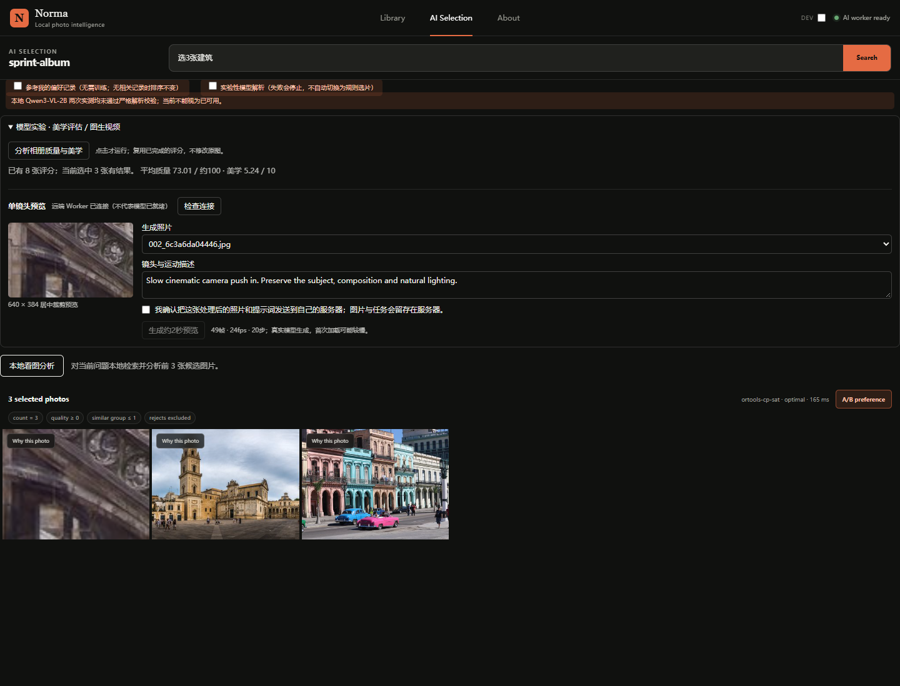

# Norma 三天 Demo：实测进度与问题记录

记录时间：2026-10-05，15:08追加真实视频结果（Asia/Shanghai）。本页是阶段验收快照，不是“整个 Demo 已完成”的交付声明。

## 追加：首条真实图生视频与兼容性修复

最终补记（15:15）：第二张公开哈瓦那街景通过真实网页完整操作，任务895712f3abf045e68bf07dfc15cef2af。勾选前按钮禁用，明确确认后只提交1次，去噪进度真实更新；worker耗时83.842秒，浏览器提交至观察完成86.947秒。HTML视频readyState=4，实际播放800毫秒后currentTime=0.809413秒，无解码错误；下载439,152字节，SHA256为1db7ecb208b272a06ba9b32447f5e1f9bc400a3bc367d58bafee79df21c1f57c。控制台、页面、HTTP错误均为0。来源为SweetMellowChill的CC0公开图片，详见ATTRIBUTION.json。不同输入、模型加载状态不同，不将两次成功耗时相减称性能提升。

- [真实网页验收记录](assets/demo-sprint-20261005/video-ui-smoke.json)
- [该任务配置与MP4哈希](assets/demo-sprint-20261005/video/895712f3abf045e68bf07dfc15cef2af.json)
- [网页实际下载视频](assets/demo-sprint-20261005/video/895712f3abf045e68bf07dfc15cef2af-ui-download.mp4)



至此低分辨率单镜头网页通路已通过两图生成和一次完整交互验证，不等于视频质量/泛化已通过；本地模型解析仍0/2成功，偏好收益尚未独立验证。

自己的单张RTX3090已生成第一条可下载MP4。模型为固定版本Wan2.2-TI2V-5B，公开建筑输入、640×384、49帧、24fps（约2.04秒）、20步、CFG5、seed42；任务总耗时89.785秒，推理期间PyTorch allocated峰值14,818,446,336字节（约13.80GiB，不是整卡显存监控峰值，重置点在模型加载后）。含模型加载，文件系统已被先前失败任务预热；不是多次平均或纯冷机基准。

前一次同输入、同参数任务124.710秒后失败且没有视频。定位到Diffusers0.35.1分块VAE遗漏patchify；使用实际已安装库的微型随机VAE纯CPU复现3/12通道错误，关闭分块后成功，再在完整预训练模型上确认成功。首失败没有保留完整栈，不能将微型复现的栈冒充原任务栈。失败耗时与成功耗时不直接计算加速比。

- [失败任务原始记录](assets/demo-sprint-20261005/video/1ade68dd8d1d458e8b8c16042e272870.json)
- [成功任务、采样阶段、MP4哈希](assets/demo-sprint-20261005/video/3470eaad8b0f4b19b7dbeca6ed5a9eb8.json)
- [真实预览MP4](assets/demo-sprint-20261005/video/3470eaad8b0f4b19b7dbeca6ed5a9eb8.mp4)
- [兼容性最小复现与完整日志](wan-vae-tiling-cpu-reproduction-20261005.md)
- [服务器实际版本](video-runtime-20261005.json)

成功视频第0帧和第48帧（不是修复前后视频对照，失败任务没有可用视频）：





源图为Traveler100的Gothic-architecture-banner，CC BY-SA 3.0；出处见同目录上级ATTRIBUTION.json。使用处理后的居中裁剪，生成视频与这些派生帧按相同许可标注，必须保留署名。此首样例原图很宽，居中裁剪损失大量构图，仅用于验证推理通路。预览目测基本稳定，但没有独立视频优质率、时序指标或运动质量评测，不能声称高质量生成已经完成。

最新完整后端回归749通过、2跳过、1条既有弃用警告，149.64秒。跳过分别为Windows上的POSIX权限测试和本机不是Diffusers0.35.1的真实VAE回归；后者另在服务器实际执行了CPU复现。前端10项真实Vue逻辑离线检查、类型检查、隔离构建通过；公开相册浏览器重验通过。新增云端同意为单次授权、提供方/文字变化即撤销；失败新选片清旧结果，旧视频明确归为历史。

目标：用现有预训练模型尽快串通“公开相册 → 学习型评分 → 选片 → 可选偏好记忆 → 3090 图生视频 → 网页播放/下载”。三天窗口按 10 月 5 日至 10 月 8 日的 72 小时目标理解；仍需以真实验收结果判断完成，不把计划日期当成完成证据。

## 1. 当前已经做到哪里

| 模块 | 本次证据 | 当前边界 |
| --- | --- | --- |
| 学习型质量、美学 | MUSIQ-KonIQ10k 与 MUSIQ-AVA 真实 CPU 推理成功；8 张公开图片已有两类分数 | 没有独立人工质量标签，不报告准确率或审美提升 |
| 现有选片流程 | 浏览器输入“选3张建筑”，返回 3 张照片；OpenCLIP 检索评分与 CP-SAT 选片实际运行 | 本次使用有界规则解析，不是大模型成功理解该请求 |
| 偏好案例记忆 | 受控集成测试：新反馈后开启记忆会改变选片；关闭后恢复原结果，数量/质量/同组约束仍满足 | 使用冻结向量案例重排，没有训练；本次公开相册浏览器测试未打开偏好开关 |
| 大模型结构化解析 | 本地 Qwen3-VL-2B 的两次真实调用均被严格校验拒绝 | 2/2 未通过；不能作为稳定可用功能演示 |
| 网页模型面板 | 真实模型分数可读，视频输入、上传确认、远端连接状态可见 | 连接成功不等于生成模型就绪，未确认时禁止提交 |
| 3090 图生视频 | 两个公开输入成功生成，第二条完整网页提交/播放/下载通过 | 640×384约2秒单镜头，不等于高质量成片、多镜头或独立效果验证 |

基础评分浏览器检查只访问 staging 服务 http://127.0.0.1:8767/，没有切换或修改原来的8765实例；该轮没有上传图片或发起VLM/视频。随后另行完成两条公开视频生成和一次浏览器完整验收，仍未上传私人图片或调用付费VLM。本轮未提交或推送。

## 2. 真实评分：测到了什么，不能说明什么

为压缩三天首版的依赖和集成成本，暂用同一 pyiqa 框架的两个 MUSIQ 预训练 checkpoint，原计划 SigLIP Aesthetic Predictor V2.5 留待后续比较。

- **MUSIQ-KonIQ10k**：通用感知质量，原始尺度约 0–100。
- **MUSIQ-AVA**：通用美学，原始尺度 1–10。
- 两者有独立权重和输出头，不是把一个规则分数换两种名称；AVA 本地加载时显式使用 10 类输出头。
- 模型只在明确分析请求中加载，本地权重先校验完整 SHA-256；没有静默下载和规则回退。

单图工程测试输入为公开照片 `gothic-architecture-banner.jpg`，对应演示文件 `002_6c3a6da04446.jpg`，SHA-256 为 `5cd90ed5f970f80c7f39fdb5eca41c72bf21fd8dcdaf24ea287b4dc6b2405e9a`。本次环境记录为 Python 3.13.5、CPU；不能把这些耗时写成 3090 性能。

| 同一输入的测量 | 数值 | 正确解释 |
| --- | ---: | --- |
| 原规则质量评分 | 85.918 | 原规则定义下的分数，保留作工程基线 |
| MUSIQ 技术质量 | 70.570671 | 新预训练模型原始值，不与规则分数直接比较“涨跌” |
| MUSIQ 美学 | 5.008424 | 1–10 的通用审美信号，不是个人偏好 |
| 首次加载并推理 | 10.846 秒 | 包含首次加载成本，单次观察 |
| 模型已加载后的再次推理 | 0.383 秒 | 复用模型实例；不是宣称模型算法本身被加速到这个比例 |

两次推理返回相同分数。本记录只有一个输入上的首载/热运行对照，没有多次计时分布、显存峰值或精度评测，因此不外推平均吞吐，不把冷启动摊销写成优化实验结论。

浏览器展示的另一个量是**当次选中 3 张照片的均值**：技术质量 **73.01**、美学 **5.24**；页面文字与后端返回的对应三张原始结果一致。这是数据展示一致性验收，不是“新方案比旧方案提升了多少”。

## 3. 本次发现并修复的实际问题：模型已加载，输入框却不能用

### 发现现象

公开测试相册已有 8 张图片，语义向量也已经准备完毕。恢复真实的已完成相册任务后，AI Selection 的输入框仍被禁用，页面错误提示用户“先建立语义索引”。浏览器脚本等待 15 秒达到超时阈值，仍无法输入。

### 根因证据

后端状态真实返回：

```json
{
  "model_backed": true,
  "loaded": true,
  "warmup_state": "idle",
  "error": null
}
```

模型已经由相册准备任务加载，但独立“预热任务”的状态仍为 `idle`。前端把“已加载”与“必须经过预热且状态 ready”绑定起来，错误排除了这个合法状态。这是运行状态判断不一致，不是图片索引失败，也不是模型尚未下载。

### 处理方式

统一使用“模型是否已经可用”的判断：模型型提供方必须 `loaded=true`、无错误，且状态是 `ready` 或 `idle`；`loading`、`failed` 和未加载仍不能放行。该判断同步复用到运行就绪判断及预热相关流程，避免仅修改按钮外观却继续触发多余预热。

### 修复前截图：真实故障，不是重建示意图



### 修复后截图：同一公开相册可以选片并显示真实模型分数



两张图使用同一公开测试相册和 staging 服务。修复后图同时展开模型面板，以展示成功选片、学习型分数和未确认上传的按钮状态。目录中的 `before-open.png` 仅是**修复后同一版本的面板折叠状态**，不得当作修复前旧版本或审美优化前结果。

### 量化验证

| 检查项 | 修复前 | 修复后 |
| --- | --- | --- |
| 索引 / 模型实际状态 | 8 张索引完成，模型已加载 | 同一相册、同一已加载模型 |
| AI Selection 可用性 | 输入禁用；15 秒就绪等待超时 | 可以提交“选3张建筑” |
| 该浏览器流程的选片产物 | 输入被阻断，未执行选片 | 成功返回 3 张照片 |
| 学习型分数展示 | 被阻断的流程未走到选片结果 | 3 张选中照片都有真实分数，均值与 API 一致 |
| 控制台 / 页面异常 / 失败请求 | 0 / 0 / 0 | 0 / 0 / 0 |
| 图片加载失败 / 横向溢出 | 未用于比较 | 0 / 无 |

“无控制台报错”不等于功能可用：这次正是状态逻辑错误导致的静默阻断。修复前后的比较证明可用性恢复，不是模型质量或端到端速度提升。

## 4. 尚未解决的问题：结构化理解 2/2 未通过

固定请求为“选3张建筑，偏暖色电影感”，真实调用本地固定版本 Qwen3-VL-2B，CPU 推理，最大输出 1024 tokens。两次测试使用了不同契约版本，不能当成独立随机样本的统计准确率。

| 尝试 | 生成 / 总耗时 | 观测结果 |
| --- | --- | --- |
| 第一次 | 112.804 / 116.207 秒 | 生成了数量 3，却又把明确请求放入不支持要求；证据与要求校验拒绝执行 |
| 第二次（v2 契约） | 93.966 / 97.122 秒 | 仍在硬约束证据里输出不被允许的 `semantic_query` 字段类型，被严格 schema 拒绝 |

当前验收状态是 **0/2 通过、2/2 失败**，只是这两次调用的结果，不代表一般化的准确率估计。保护性校验没有放松，也没有把错误解析静默转成成功选片。本次网页成功演示走的是规则解析＋OpenCLIP＋约束优化器，不能将它混写成大模型解析成功。

后续优先处理生成契约遵循和 CPU 延迟：明确合法字段、采用兼容的结构化输出约束、增加固定请求回归，并在可用算力上分别测质量和延迟。不能为了完成 Demo 删除硬条件验证或用无限重试隐藏失败；暂时保留明确可用的规则入口。

## 5. 偏好记忆验证：工程成立，用户收益未证明

新增模块把同一用户、同一 OpenCLIP 提供方下的历史胜负案例，按任务相关度检索，给候选增加最多 ±0.15 的软分数修正。原图、向量文件和提供方身份都有证据绑定；缺少历史快照的老反馈不回填，平局/跳过不强制转成正负例，助手代理标注默认隔离。

相关 51 项测试通过，其中受控集成案例验证：记录新反馈 `b > a` 后，显式启用记忆使结果从 `{a,c}` 变为 `{b,c}`；关闭开关恢复原排序。目标张数为 2、最低质量 60、同相似组最多 1 张等硬约束保持成立，训练模型表仍为空。测试使用受控向量，**不是“真实用户更喜欢新结果”的证据**，也不是 DPO 或训练个人模型。

## 6. 14:53拟定的下一步清单（视频通路现已通过，当前优先后续项）

三天内的基本 Demo 验收线收敛为：公开相册可打开、学习型评分真实运行、可用选片入口、偏好开关可解释、确认后向自己的 3090 上传一张处理后的图片、真实模型生成单镜头、网页可播放和下载。

1. **优先完成第一条真实视频**：固定公开输入，低分辨率约 2 秒预览；记录模型/权重版本、种子、帧数、步数、时间、显存与失败日志。下载完成、Worker 可连接都不替代这一步。
2. **验证受控上传与生命周期**：未确认不得上传，取消/失败可见，刷新可恢复任务查询，服务重启不能把失败任务伪装成完成。
3. **打通重复演示**：使用固定公开样例至少重跑相册到视频路径，完整保存输入、选片请求和产物；区分单镜头成功与多镜头约 15 秒成片。
4. **处理结构化理解的明确失败**：保留上面的两次失败记录，达到小型固定回归验收后才将大模型入口写为“可用”；三天首版不以它阻断已有可用选片基线。

后续优化队列仍保留：MUSIQ-AVA 与 SigLIP 美学模型比较、相关/随机记忆消融、独立用户反馈、分镜与视频时序评测、资源优化，以及有证据支撑后再选择 Alpha 或一项小规模后训练。Alpha、DPO、SFT、视频 LoRA、增量预训练不属于这次三天必须完成项；当前也没有完成这些功能的证据。

## 7. 14:53历史阶段总结（最终成果补记见页首）

本轮将 Norma 从仅有规则质量信号的相册流程，推进到使用不同预训练 checkpoint 分别评估技术质量与通用美学的网页演示，并以冻结 OpenCLIP 案例记忆实现可关闭、可引用历史证据、受硬约束保护的个性化重排；通过真实公开相册浏览器验收，定位并修复了“模型已加载但预热状态为 idle 导致输入禁用”的状态一致性问题，保留同输入修复前后截图和原始日志。同时如实记录本地结构化解析两次失败，严格区分单元测试、真实模型推理、用户偏好收益和视频生成验收，下一步重点是在用户自己的 3090 上完成首个可播放的真实图生视频，将工程可用性、失败分析和后续可量化优化形成闭环，而不将模型调用包装成训练经验或未经验证的效果提升。

## 8. 原始证据与复查入口

- [单图真实评分与计时](aesthetics-demo-20261005.json)
- [浏览器验收记录](assets/demo-sprint-20261005/browser-smoke.json)
- [修复前状态记录](assets/demo-sprint-20261005/readiness-before-fix.json)
- [公开图片来源与许可](assets/demo-sprint-20261005/ATTRIBUTION.json)
- [结构化解析原始记录](local-intent-smoke-20261005.json)（公开固定文本，无凭据）
- [可重跑浏览器脚本](../../scripts/check_demo_ui.cjs)
- [三天范围与后续优化](../demo-sprint-3days.md)
- [偏好记忆算法说明](../preference-memory-demo.md)

截图中的照片来自公开 Wikimedia 演示数据，展示时经过缩略/居中裁剪。作者、来源页及各自许可保存在资产目录的 `ATTRIBUTION.json`；公开发布时仍需逐图遵守对应许可。本次使用的是历史开发图片，不把它们当作新的独立审美或偏好测试集。
