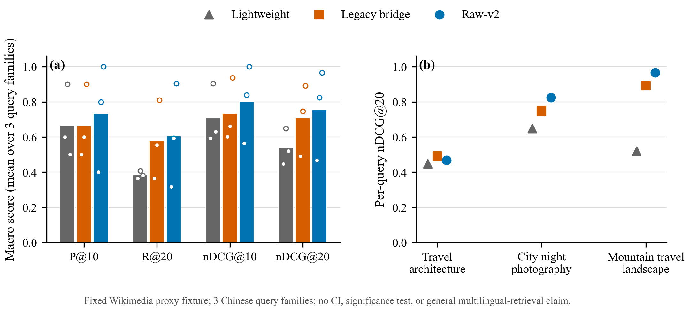

# OpenCLIP raw-v2 multilingual proxy retrieval pilot

Date: 2026-08-28 (Asia/Shanghai)

## Scope and ranking contract

- Candidates: 81 local JPG/JPEG files from the public Wikimedia Commons fixture.
- Proxy-labeled images: 72; nine synthetic derivative/duplicate candidates are
  unjudged and count as non-relevant.
- Query families per language: 3 (`travel architecture`, `city night
  photography`, and `mountain travel landscape`, plus their Chinese forms).
- Labels: download search terms, not blind human relevance judgments.
- Ranking: cosine score rounded to six decimals, then quality score descending,
  then stable photo UUID. This is the production search tie-break contract.

The comparison uses the same image pool and ranking code for every provider.
Legacy bridge results reuse raw-v2 image vectors because that ablation changes
only text preparation. The raw-v2 Chinese path preserves the original Unicode
query and sends it directly to XLM-R.

## Macro results

| Language | Provider / query path | MRR | P@10 | R@20 | nDCG@10 | nDCG@20 |
| --- | --- | ---: | ---: | ---: | ---: | ---: |
| English | Lightweight | 1.000 | 0.667 | 0.384 | 0.709 | 0.539 |
| English | Raw-v2 | 1.000 | 0.800 | 0.608 | 0.822 | 0.746 |
| Chinese | Lightweight | 1.000 | 0.667 | 0.384 | 0.709 | 0.539 |
| Chinese | Legacy bridge | 1.000 | 0.667 | 0.576 | 0.733 | 0.710 |
| Chinese | Raw-v2 | 1.000 | 0.733 | 0.605 | 0.801 | 0.753 |

## Interpretation and limitations

On this directional pilot, raw-v2 improves the Chinese macro nDCG@20 from
0.539 (lightweight) and 0.710 (legacy bridge) to 0.753. The per-query panel is
essential: raw-v2 is strongest on the city-night and mountain families but is
weaker on the architecture family. Therefore this result supports only that the
raw multilingual path is wired correctly and can outperform the two baselines
on this fixed proxy fixture; it does not establish general multilingual
retrieval quality.

There are only three query families, labels inherit Wikimedia search bias, and
the same search terms helped define both the pool and relevance proxy. The
values are deterministic observations from one fixed run, so no confidence
intervals or statistical-significance claims are reported. A publishable
evaluation still requires independently authored queries, pooled retrieval
candidates, blind human graded judgments, and enough query families for
uncertainty estimates.

## Reproduction

- Raw result: `figures/openclip_raw_v2_proxy_eval_20260828.json`
- Benchmark runner: `figures/benchmark_openclip_raw_v2_proxy.py`
- Figure generator: `figures/gen_fig2_openclip_proxy_retrieval.py`
- Vector figure: `figures/fig2_openclip_raw_v2_proxy_retrieval.pdf`
- LaTeX table: `figures/TABLE_openclip_raw_v2_proxy_retrieval.tex`

The earlier retrieval report used a different tie-break treatment for tied
lightweight scores. Its OpenCLIP English macro values reproduce here, while the
lightweight MRR/nDCG change slightly under the current production contract.
Cross-provider conclusions in this document therefore use only the freshly
rerun, same-contract rows above.
