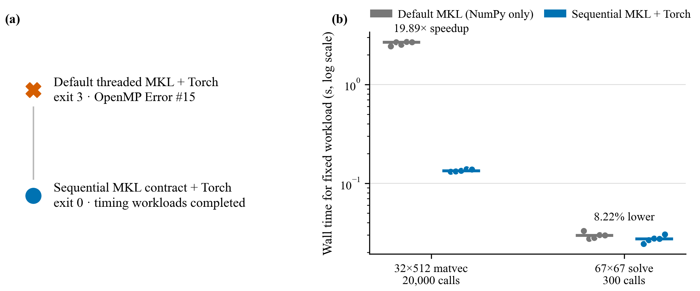

# Windows NumPy/Torch native-runtime compatibility

Date: 2026-08-29. This is an engineering compatibility benchmark, not a model
quality result.

## Failure and root cause

The original single-process sequence was deterministic on the tested Anaconda
base environment:

```powershell
python -c "import numpy as np; import torch; print(np.ones((32,512)) @ np.ones(512))"
```

It exited with code 3 and OpenMP Error #15. The environment contained NumPy
2.1.3 built against Anaconda MKL 2023.1 and PyPI Torch 2.7.1. The two binary
runtimes were not identical:

| Owner | File version | Bytes | SHA-256 |
|---|---:|---:|---|
| Anaconda `Library/bin/libiomp5md.dll` | 20230118 | 2,047,000 | `0AD71F466D115D353DCE94BA32B63E288F48198E89F551D46DCCE461FEDBD195` |
| PyPI `torch/lib/libiomp5md.dll` | 20250108 | 1,602,416 | `15E6F874A53CB54A8E266099C8DA92484C6F50301D117F9A5443846E9ECE90B5` |

With the default threaded MKL layer, the process loaded
`mkl_intel_thread.2.dll`; the first NumPy BLAS operation then attempted to
initialize Anaconda's OpenMP runtime alongside Torch's bundled runtime.

## Product fix and correctness boundary

Norma now sets `MKL_THREADING_LAYER=SEQUENTIAL` at the `ai` package boundary,
before any project NumPy, OpenCV, or Torch import. The pytest harness installs
the same contract in `ai/tests/conftest.py` before collecting test modules,
because some tests import NumPy at module scope. The successful process loaded
`mkl_sequential.2.dll` plus Torch's `libiomp5md.dll`; it did not load Anaconda's
`Library/bin/libiomp5md.dll` or `mkl_intel_thread.2.dll`.

The regression process performs NumPy `32x512 @ 512`, constructs the default
OpenCLIP-backed CLI provider (which imports Torch), repeats the NumPy product,
and solves a 67x67 system. It exits zero with results `512.0`, `512.0`, and
`0.5`, and module enumeration confirms exactly one loaded `libiomp5md.dll` from
Torch. A second subprocess imports NumPy before Norma in an isolated `-S`
interpreter and verifies that the already-loaded `mkl_intel_thread*.dll` is
detected: the OpenCLIP entry point raises a Python domain error before Torch is
imported and never reaches a native OpenMP abort.

`KMP_DUPLICATE_LIB_OK` is deliberately unsupported because it permits two
incompatible runtimes to continue and can hide corruption or later crashes.



The figure is reproducible from the checked-in
[raw observations](../../figures/windows_numeric_runtime_20260829.json) with
the [generation script](../../figures/gen_figS1_windows_numeric_runtime.py).

## Representative numeric overhead

Fixed-data microbenchmarks on the affected machine produced:

| Workload | MKL Intel-threaded | MKL sequential | Observation |
|---|---:|---:|---|
| NumPy 32x512 matvec, 20,000 calls | 2.677737 s | 0.134600 s | sequential was 19.89x faster for this small workload |
| NumPy 67x67 solve, 300 calls | 0.029865 s | 0.027410 s | sequential was 8.22% faster |

These shapes represent Norma's retrieval/preference linear algebra, where
OpenMP launch overhead dominates. The comparison is a five-repeat median from
one Windows machine; it is not a substitute for an end-to-end OpenCLIP or Qwen
latency benchmark and does not support a general BLAS performance claim.
