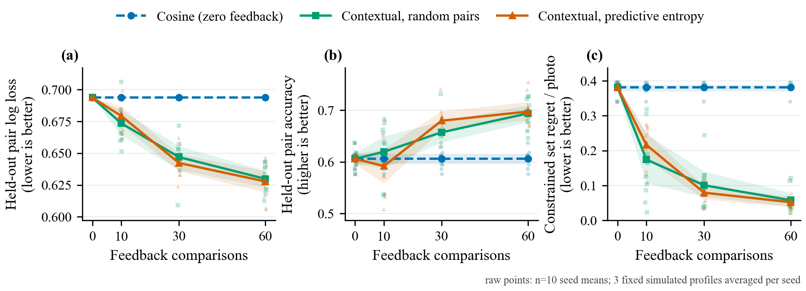

# Norma 项目技术与面试讲解

更新时间：2026-10-06。依据当前代码和本地实测记录整理，区分正在使用、已有但非默认、尚未验证的能力。

## 1. 先用一分钟说清楚项目

Norma 是一个面向旅行相册的本地优先多模态应用。用户导入照片后，用预训练 MUSIQ 评估技术质量和美学，用 OpenCLIP 和空间匹配压缩重复构图，再根据自然语言要求选择一组照片。系统把数量、类别配额和必留照片转为可执行约束，通过 CP-SAT 选择整个集合，而不是只取分数最高的前几张。可选的偏好案例记忆提供有限幅度的个性化重排。最后把选中的照片发送到自有 GPU 上的 LingBot-World-v2，用户通过 WASD 和方向键分步生成新的视角，形成非实时探索视频。

主要工作不是从零训练基础模型，而是任务拆解、预训练模型集成、约束优化、状态化推理、缓存优化、可追溯验证和完整产品链路。

**不要说：自研世界模型、完成 DPO、已证明符合用户审美、真实三维重建、实时无限探索。**

### 目前的能力边界

| 部分 | 当前实际情况 |
| --- | --- |
| 照片美学与质量 | 冻结 MUSIQ-AVA / MUSIQ-KonIQ10k，真实推理 |
| 中文图文检索 | 冻结多语言 OpenCLIP，512维向量 |
| 数量与类别 | 有界语言解析 + 可选 Qwen 语义解析 + 求解器 |
| 相似构图折叠 | 哈希近重复 + OpenCLIP + SIFT/RANSAC |
| 个性化 | 冻结向量案例记忆；允许使用明确标记的助手代理案例 |
| 轻量偏好学习 | 代码中有旧的可选 adaptive 路径，当前 Demo 默认不启用 |
| RAG | 有独立的检索→看图生成→引用校验接口，不等于选片按钮 |
| 人物覆盖 | 当前 Demo 依靠用户指定 A/B 代表照片，不自动核实身份 |
| 视频探索 | 固定版本 LingBot-World-v2 1.3B causal-fast，有限步、非实时 |
| 独立效果评估 | 已有工具，真实独立标签和个性化收益证据仍缺 |

“两个不同的人各至少一张”的完整请求，仍需要用户指定两张对应代表照；两张人像不自动等于两个不同的人。该限制与其他已跑通的 Demo 链路分开陈述。

## 2. 总体架构：数据怎样流动

照片目录 → 本地目录索引/缩略图 → 按需模型评分和向量缓存 → 美学门槛与相似构图折叠 → 自然语言意图 → 图文相关性/质量/可选偏好 → 整组约束求解 → 选两张图 → 远端有状态视频会话 → 播放、动作续生、下载。

工程组件：

- Vue + TypeScript：照片列表、任务进度、选择条件、视频控件。
- Python + FastAPI：参数验证、流程编排、模型调用、状态接口。
- SQLite：相册、照片、任务、评分/向量元数据、选片及反馈记录。
- 本地文件：缩略图、向量、模型、报告，不复制和改写所有原图。
- 远端私有 worker：高算力视频推理；一次 worker 承载一个活跃场景。

本地网页服务不应直接暴露到不可信网络。远端 worker 使用令牌和回环监听，配合 SSH 转发；不能把这称为已经完成多租户生产安全体系。

**【高频追问】为什么不让一个大模型看全部照片，直接给出9张？**

可以作为对照，但当前分层方案把重复计算缓存起来，保留原图本地处理，降低大批图像输入成本；最重要的是，模型理解和结果合法性分离，可以检查数量、配额、必留条件，不依赖一次自由生成全部正确。代价是模块多、误差会传递，尤其候选预筛选可能误折叠有价值照片。

**【高频追问】这是算法项目还是套模型？**

基础模型不是我训练的。我的算法与系统工作在于：将组级选片建模为带硬约束和冗余代价的优化问题；组合语义相似与几何证据处理相近构图；构建有证据的偏好记忆；实现跨动作视频状态和增量解码，并针对失败案例验证。不能把集成说成原创基础算法。

## 3. 导入、按需任务和缓存

导入先建立本地相册目录与缩略图。昂贵的语义索引、美学、人脸等分析不是打开文件夹就全部跑；主 Demo 通过“美学评估”编排需要的准备工作。

任务使用线程池和持久化任务状态，前端查询状态显示进度。进度按实际完成照片数映射到阶段区间，不是随便运行的计时动画，也不是精确剩余时间估计。取消主要在阶段或批次检查点生效，不能保证立刻打断一个正在执行的底层算子。

缓存绑定原图内容哈希和模型/预处理指纹，而不是只认路径：

- 同一路径可以被另一张照片覆盖；
- 同一模型名称可能对应不同权重版本；
- 同一权重的缩放、颜色、归一化和推理后端也会改变向量。

因此向量记录需要知道“哪份图片字节，经由哪份模型和处理契约产生”。部分严格流程会重新检查 SHA-256；这增强正确性，也带来磁盘读取成本。不能说所有操作都零成本缓存命中。

真实增量例子：trip 原来158张，增加天坛和雪山后160张，质量/向量准备只计算新增2张、复用158张。

**【高频追问】为什么不用 Redis、Celery、向量数据库？**

当前是百张级单机 Demo，线程池 + SQLite + 本地向量足以覆盖需求。尚未实现分布式任务调度和百万级检索。更大规模才考虑外部队列、向量索引、并发隔离和监控。

## 4. 美学与技术质量：为什么是两套 MUSIQ 权重

MUSIQ 是多尺度图像质量 Transformer：利用不同尺度图像块和位置信息综合判断图像质量，而不是只计算一个清晰度或亮度数值。算法背景见 [MUSIQ 原论文](https://arxiv.org/abs/2108.05997)。

项目通过固定版本 pyiqa 加载两个预训练 checkpoint：

- MUSIQ-KonIQ10k：技术质量，输出近似0～100尺度。关注图像整体技术质量，不能把输出直接解释成某一个缺陷的概率。
- MUSIQ-AVA：美学质量，1～10尺度。底层使用10档评分头；它反映训练数据中的审美统计，不等于某个用户的真实喜好。

预处理：EXIF 方向矫正、RGB、保持比例的长边限制，默认最长1024，不上采样；固定权重 SHA 和依赖版本；推理不计算梯度。当前保留基础技术质量拒绝门槛，因此系统并非完全没有传统规则。

设原始美学分为 A，技术分为 T：

$$
a=\operatorname{clip}((A-1)/9,0,1),\quad
t=\operatorname{clip}(T/100,0,1).
$$

无语义条件的质量代表排序采用：

$$
u_{\mathrm{quality}}=0.65a+0.35t.
$$

美学筛选中 A 已被验证在1～10范围，所以代码直接使用 (A-1)/9 与上述等价。默认门槛为 A≥5、T≥40，再保留相似组中的高分代表。

**【高频追问】这些权重是学出来的吗？**

不是。这是固定 Demo 策略，没有用独立留出集优化。模型输出是学习得到的表征/预测，但融合权重和阈值是人工策略。这两件事必须分开。

**【高频追问】MUSIQ 能输出“色彩协调0.8、构图合理0.9”吗？**

目前不能。当前输出整体技术分和美学分，没有监督训练过独立的色彩、构图、风格解释头。不能从一个整体分数编造多个具有物理含义的分项。

**【高频追问】评分5.9一定比5.8好看吗？**

不一定。小分差不意味着可靠的主观差异，且有领域偏移。模型分数用于排序和筛选辅助，不是美学真值。

## 5. 相近构图：为什么哈希不够，为什么又不能只用 CLIP

需要区分三种相似：

1. 文件完全一样：文件哈希相同。
2. 像素近似/轻微改动：感知哈希更适合。
3. 同一场景的变焦、裁切、稍微换机位：需要更强的视觉和空间证据。

旧问题：用户看到的“美学保留”只走了哈希近重复，学习特征去重当时只在下游文字选片生效。所以雪山近景、白塔等明显构图相近的照片仍然占很多格子。根因既是算法能力不足，也是使用阶段放错。

目前美学阶段采用分层策略：

- 沿用原有 pHash/dHash 近重复组。
- 候选按质量综合分从高到低处理。
- 读取内容验证过的 OpenCLIP 图像向量。
- 两图余弦≥0.97：直接作为高相似画面折叠。
- 0.90≤余弦<0.97：再做 SIFT 匹配和 RANSAC 单应矩阵验证。
- 余弦<0.90：本层不折叠。

几何验证的含义：

- SIFT 寻找局部稳定关键点；
- 最近邻比值测试排除不明确匹配，当前阈值0.7；
- RANSAC 寻找多数匹配共同支持的几何映射，当前重投影阈值3像素；
- 至少12个内点、内点比例至少0.6；
- 双向画面覆盖至少0.35，关键点分布覆盖至少0.08；
- 对齐后的灰度相关性至少0.75。

这些是开发集上的显式启发式阈值，不是“重复概率”。单应矩阵也不是普适三维场景模型，强视差和动态物体会让这种方法失效。

保留策略不是把所有相似边做连通分量：如果 A近似B、B近似C，但A不近似C，不能因此把三张全并成一组。当前只与已经保留的高分代表比较，是质量优先、非传递的贪心抑制；它不是最优聚类。

真实开发相册对比：

| 指标 | 修复前 | 修复后 |
| --- | ---: | ---: |
| trip总数 | 160 | 160 |
| 美学保留 | 104 | 37 |
| 折叠 | 56 | 123 |
| 用户指出的6张雪山近景 | 6 | 1 |
| 3张白塔近似构图 | 3 | 1 |
| 河流草甸远景组 | 2 | 1 |

雪山近景和更宽的河流草甸环境景仍分别保留；天坛、金色雪山也保留。所有160张原文件 SHA 未改变。

**【重点边界】104→37不是准确率提升，也不自动表示越少越好。** 当前阈值在此相册调过，还可能误折叠；没有独立标注集上的重复检测精确率/召回率。≥0.97分支不走几何核验，这是可能误合并的来源之一。

**【高频追问】SIFT不是旧算法吗，为什么使用？**

语义模型和几何方法解决不同问题。CLIP擅长语义相似，却可能把两张不同雪山都判为很像；几何验证检查具体画面对应关系。是否采用某算法取决于问题，不取决于名字是否新。

**【高频追问】为什么“相似只留最佳”不直接删除文件？**

判定可能错误，且用户可能重视回忆价值而不是模型分数。当前只是折叠展示、记录替代对象和原因，原图不删。不能把“查看折叠”说成已经实现完整的一键恢复与重求解工作流。

## 6. OpenCLIP：文字怎么找到照片

实际模型：

- xlm-roberta-base-ViT-B-32；
- 预训练标签 laion5b_s13b_b90k；
- 图像、文字编码到归一化的512维共享空间；
- 中文文字使用模型原生多语言文字编码器。

OpenCLIP 是开放实现和模型体系，本项目选用其中现成的预训练权重，不是自己从零训练。[官方实现](https://github.com/mlfoundations/open_clip)

核心计算：

$$
v_i=\frac{f_{\mathrm{image}}(I_i)}{\|f_{\mathrm{image}}(I_i)\|_2},\quad
q=\frac{f_{\mathrm{text}}(s)}{\|f_{\mathrm{text}}(s)\|_2},
\quad c_i=q^\top v_i.
$$

因为向量单位化，点积就是余弦相似度。“雪山照片”的向量应更接近雪山图像，而非食物图像，但这不是严格逻辑判断。

当前 Demo 选片基础相关性使用 max(0,c_i)，再融合：

$$
u_i=0.72\max(0,c_i)+0.18a_i+0.10t_i.
$$

这里和独立 retrieval 搜索端点的原始余弦排序要区分；不要把两条路径的公式混用。有开启案例记忆时，再添加受限的偏好增量。

上游 CLIP 的基本训练思想是对比学习：提高成对图文的相似度，降低非配对图文的相似度。Norma 只运行训练好的编码器，不运行这种训练。

**【高频追问】为什么 CLIP 不能直接保证“一张人物、五张风景”？**

CLIP 给每张照片相关性，不负责集合数量或逻辑关系。top-k可能选出多张近似风景，或者错过人物配额。所以后面必须做类别证据和集合约束。

**【高频追问】使用 FAISS/HNSW了吗？**

当前选片是百张级缓存向量的直接评分，不应声称已经做了大规模向量检索优化。语义评分约O(Nd)，成对多样性约O(N²d)。扩展到大规模可先近似召回再对小候选集求解，但那是后续设计，不是当前成绩。

## 7. 复杂要求：文字模型与硬条件分开

可选模型为 Qwen3-VL-2B-Instruct。虽然该基础模型支持视觉输入，**当前选片解析调用只输入文字**；图片内容由 OpenCLIP 等路径处理。模型资料见 [官方模型卡](https://huggingface.co/Qwen/Qwen3-VL-2B-Instruct)。

流程分两层：

- 字面硬条件：总张数、已支持的人像/自然风景配额，后端从原文提取并保留来源。
- 内容与软风格：可选 Qwen 生成语义查询和风格字段，再通过严格 JSON 与原文来源检查。

例如“挑出最有代表性的6张照片，一张人5张风景”：

- 总数6；
- 人物主体1；
- 自然风景主体5；
- 代表性通过质量、相关性和集合多样性近似，而不是“代表性真值模型”。

解析不是任意中文都能执行的通用 Agent。当前只支持有界语法和类别；不支持、冲突、来源不明的要求会拒绝，而不是自动少选、凑数或删除条件。

历史真实故障：

1. 描述性句式带逗号后，数量识别没覆盖，系统错误使用默认9张；
2. 小模型把提示中的负例当成用户需求，引发“Requirement issue is not grounded in the request”；
3. 前端失败后仍显示正在理解，造成状态误导。

处理：扩充有界数量解析；让明确数字由服务器核验；收紧模型输出结构并移除会被照抄的具体负例；保留来源校验；错误状态停止加载并给可理解提示。

**【高频追问】为什么不删掉严格校验，让请求先跑通？**

那样会把可见错误变成隐性错误：页面有结果，但执行的是模型擅自添加或遗漏的需求。正确做法是改提示、结构化契约和解析分工，不是取消检查。

**【高频追问】temperature=0是不是就不会出错？**

不是。它有助于减少采样随机性，但不能保证理解正确、JSON合法、来源真实，更不能保证跨硬件逐位一致。仍需要服务端校验和结果检查。

## 8. 类别配额与 CP-SAT：从选单张变为选一组

### 8.1 不另训分类器的主体分类

用 OpenCLIP 对人物主体、自然风景主体、其他三类各构造3条中英文文字描述。每类文字向量求平均后归一化，作为类别原型；图像与原型计算余弦，最高类作为预测。

最高与次高相似度差小于0.015则记为 uncertain，不让它充当确定类别配额。这个差值不是经过校准的概率。

当前“风景”是自然景观主体；建筑如天坛属于此分类器的 other，不能暗中算作自然风景。用户需要“旅游照片”不等于只要自然风景。

### 8.2 优化目标

对候选照片 i 定义 x_i∈{0,1}，选中为1。概念目标：

$$
\max_x \sum_i (u_i+\Delta_i)x_i-\sum_{i<j}p_{ij}y_{ij},
\quad y_{ij}=x_ix_j.
$$

约束包括：

$$
\sum_i x_i=K,\qquad
\sum_{i\in P}x_i=K_P,\qquad
\sum_{i\in L}x_i=K_L.
$$

还包括同组上限、必留照片 x_i=1，以及高相似对 x_i+x_j≤1。

中度重复的软惩罚：

$$
p_{ij}=0.35\frac{c_{ij}-0.80}{1-0.80},
\quad 0.80<c_{ij}<0.97.
$$

≥0.97使用硬互斥，不再只是软减分。y通过三个线性约束与x绑定，交给 CP-SAT。当前分数转整数，单worker、固定seed、最多2秒，接受 optimal 或 feasible 并记录状态。

**【高频追问】为什么不用直接排序或者 MMR？**

排序只看单张价值。MMR可以做相关性与多样性权衡，但一般贪心MMR不会天然满足精确类别配额和指定必留。本项目将这些条件明确建模。代价是候选/成对变量增多时求解变贵。

**【高频追问】返回 feasible 能叫全局最优吗？**

不能。只代表找到满足约束的解，可能没有在时限内证明最优。模型预测有误时，数学上满足“预测类别配额”也不等于真实视觉类别完全正确。

**【高频追问】如果要求互相冲突呢？**

拒绝并解释，不默默降低条件。例如总数6却要求人物2+风景5；或两张必留图又被判为互斥；或质量门槛后类别数量不足。

开发集实测：原来“6张、1人5景”返回9张且有人物/重复问题，修复后返回6张、1个人物主体、5个自然风景主体，重复湖景从4张变1张。此处有实际结果与人工查看，但不是独立类别准确率评估。

## 9. 个性化：现在究竟学了什么

### 9.1 当前主流程是案例记忆，不是后训练

保存一次偏好案例：当前查询、喜欢的照片、不喜欢的照片、来源、当时模型指纹、原图和向量摘要。检索相关历史案例后，对当前候选做受限重排，模型参数不更新。

设当前查询q、历史查询q_j、胜者向量v_j⁺、败者向量v_j⁻，历史相关性s_j=qᵀq_j。只使用s_j>0.2的案例，取最相关的最多8条；先看最近最多64条合法历史。

$$
w_j=\left(\frac{s_j-0.2}{0.8}\right)^2,\quad
Z=\max(1,\sum_jw_j).
$$

对候选v_i：

$$
\Delta_i=
\operatorname{clip}\left[
\frac{0.15}{Z}
\sum_jw_j\frac{v_i^\top(v_j^+-v_j^-)}2,
-0.15,0.15
\right].
$$

直觉：新图更像历史喜欢的、少像历史不喜欢的，就适当加分；历史任务不相关则不引用。调整幅度有上限，最终仍受数量、必留、多样性等约束限制。

目前有8对助手代理标注，其中6对有胜负、2对平局；平局不作为preferred方向案例参与上述计算。代理来源明确记录为 assistant_proxy，且只在用户允许时使用。

**【高频追问】这叫偏好学习吗？**

广义上是利用反馈个性化，但严格说当前路径是非参数案例记忆重排，没有梯度更新。面试应说清楚，不能叫已经做了DPO或微调。

**【高频追问】按助手喜好标注能代表用户吗？**

不能。它是启动Demo的代理数据，不是用户真实标签。当前证明机制可运行，不证明用户满意度提升。

### 9.2 代码中的可选轻量学习路径

仓库还有独立 adaptive 路径，当前不与主流程融合评分/案例记忆混用。

该路径把512维向量通过固定投影压缩到32维，构造：

$$
\phi(I,q)=[Pv,\ (Pv)\odot(Pq),\ q^\top v,\ b_{\mathrm{reject}},b_{\mathrm{missing}}]\in\mathbb R^{67}.
$$

效用为基础余弦加线性残差；成对胜负用logistic模型，带高斯先验对应的L2正则，优化后用Laplace近似保存后验协方差。此处是小型偏好模型，不是修改OpenCLIP或大语言模型参数。

**不要把旧可选实现的存在，写成这次Demo实际开启并验证了其收益。**

**【高频追问】为什么不直接做DPO？**

目前任务是选择照片，不是训练一个生成策略输出偏好答案；冻结表征上的排序/记忆是更直接的起点。DPO涉及策略相对参考策略的偏好目标，不是有chosen/rejected二元数据就自动叫DPO。真要做，先定义可训练策略、输出形式、数据协议及独立评估。

## 10. RAG：不要把向量检索和生成混为一谈

当前选片主流程：文字解析→图片相关性与集合求解。它不等于完整的“检索增强看图回答”。

仓库独立RAG链路：

1. OpenCLIP检索少量Top-K，接口限制1～6张；
2. 冻结选中照片字节，校验来源与向量一致；
3. 向本地Qwen视觉语言模型或配置的云端适配器提供图像与证据；
4. 生成结构化claims和照片引用；
5. 服务端检查引用只指向本次证据、摘要一致、输出结构合法；
6. 保存不可变审计记录。

有云端适配器不代表任意兼容聊天API都具备视觉能力，也不代表每次选片都会调用DeepSeek。配置、模型能力、用户授权和调用路径必须分别确认。

**【高频追问】引用校验通过，是否就说明答案正确？**

不。它证明引用ID和实际传入证据对应，不证明句子被图像语义支持。响应明确标记 semantic_entailment_verified=false。要证明视觉结论还需要人工或独立验证。

**【高频追问】图片RAG与文档RAG的区别？**

检索单元是图像、表征是图文共享向量、证据快照是图片字节；生成模型必须真的接收到并能理解图像，而不是只看到文件名后猜测。

## 11. 视频探索：按键不是控制播放器

实际接入固定版本 LingBot-World-v2 的1.3B causal-fast路径，参考 [上游仓库](https://github.com/Robbyant/lingbot-world-v2)。当前本地适配保留上游非商用许可约束，不能把可下载等同于已获商用许可。

两张图片分别初始化两个独立场景，不是把两图混合生成同一个三维世界。主适配器宽384，高按比例取16倍数并限制256～640，使用pad适配模型画布；所以不能声称生成输入完全保留原始分辨率和任意宽高比。后续“按键叠加不改变画幅”指不改变已经生成的视频尺寸。

### 11.1 一个动作怎样进入模型

- W/S：前后移动；
- A/D：左右平移；
- 方向键：转动视角；
- 当前一次提交一个方向，不支持同时组合键。

按键先变为局部坐标中的平移或旋转，更新相机位姿，再沿动作生成一段姿态轨迹。模型用这些姿态和假定相机内参产生Plücker射线条件，参与视频生成。

Plücker可以粗略理解成“每个像素对应空间中哪条视线”的表示，常写为方向d与矩m=o×d；实现里的通道顺序遵循上游，不能拿这个解释当作随意交换通道的依据。

平移幅度0.25是任意场景尺度，转向约5度；输入单张普通照片无法知道真实米制深度和相机标定。条件被传入模型不等于输出运动严格符合指令。

### 11.2 为什么是有状态续生

会话跨动作保留：

- DiT自注意力KV缓存；
- 文字交叉注意力缓存；
- 累计相机姿态；
- 已生成latent；
- 连续随机数生成器；
- 可选的因果VAE解码缓存。

不是每点一次按钮就取上一段最后一帧，重新进行独立图生视频。后者容易丢历史，也不是当前适配器的实现。

当前每个动作新增6个latent，拆成2组、每组3个；fast路径每组4个去噪时刻，并额外做缓存更新前向。不要把“4个去噪时刻”说成整个动作只运行4次网络。

帧数关系：

$$
L=6n,\qquad F=4(L-1)+1=24n-3.
$$

所以7步165帧，16fps播放为10.3125秒；14步333帧，为20.8125秒。16fps是播放速度，不是推理速度。

### 11.3 前端和服务端怎样防止状态乱掉

视频卡片有各自会话，只有当前激活卡片接收键盘；生成期间锁住重复操作，携带顺序号，后端检查状态。取消在安全检查点触发，发生状态污染风险时终止会话，保留此前已生成文件，不继续利用部分修改的缓存。

回放时按动作历史时间段高亮按键。下载的MP4只是视频，不具有按键交互能力；交互存在于网页和生成服务之间。

页面刷新可以恢复已有会话信息和播放；worker重启后显存缓存不存在，要新建会话，不能声称跨进程恢复了完整生成状态。

### 11.4 重点优化：因果VAE增量解码

旧版第n步重新解码所有历史latent。若每步增加固定长度，累计解码量近似1+2+…+n，即O(n²)。

新版保存因果卷积特征缓存，每步只解码新增latent，解码部分累计量近似O(n)。不能独立解码孤立片段后直接拼接，否则丢失因果历史，可能边界不连续。

同一组固定FP32 latent、384×640的开发对照：

| 步数 | 全前缀解码 | 增量解码 | 最大像素差 |
| --- | ---: | ---: | ---: |
| 7 | 18.793秒 | 2.685秒 | 0 |
| 14 | 37.887秒 | 2.682秒 | 0 |

这是单项解码实测，不含模型加载、去噪、网络传输和MP4编码；不是端到端加速倍数。测试输入为随机latent，不能据此声称视频更好看。

第一次BF16对照出现0.03125误差，没有通过既定阈值；保留失败记录，改用与生产VAE一致的FP32测试。精度与误差相关，但没有定位到具体底层算子，不能编造根因。

当前还保留全部CPU帧并重新编码累计预览，内存与保存成本仍增长。只支持7/14步的有界配置，不是无限探索。

**【高频追问】能说实时世界模型吗？**

不能。初始化实测约183/189秒，另一次14步雪山测试每步约6.823～11.060秒，且都是特定运行记录。用户可以等待生成再选择下一步，属于非实时动作条件视频探索。没有真实3D资产、没有保证回环一致性。

**【高频追问】为什么任务结束GPU还占显存？**

可能仍有模型、KV、VAE缓存引用，也可能是PyTorch分配器缓存；GPU利用率0不等于显存释放。empty_cache不能释放仍被引用的张量。关闭会话需要清理状态/模型，演示结束还应停止属于Norma的worker；不能误停其他项目。此次说明没有重新启动GPU任务，也未把旧释放记录当作当前实时监控。

## 12. 验证方法、局限和面试表达

### 已有的证据分层

1. 单元/契约测试：验证解析、缓存失效、约束、不合法输入、取消等；最新现有后端报告为970通过、2跳过。
2. 真实集成：trip选片、真实模型推理、浏览器播放、下载哈希等。
3. 控制变量实验：同latent比较prefix/stream解码。
4. 尚缺：独立相册标签、真实用户偏好、视频控制和长程一致性系统评估。

这些不能相互替代。970通过不是970张照片都选对；开发集修复不是测试集泛化；网页mock回归不是GPU推理；助手标注不是独立用户研究。

本次只复核了已有记录和代码，没有重跑完整测试或视频推理。

### 若面试官问“你怎么评估？”

当前能报告的：硬约束满足、实际数量、指定构图族压缩情况、未修改原图、解码等价误差和阶段时延、产物帧数/时长/哈希。

下一阶段评测设计（尚未完成）：

- 按旅行/拍摄批次分组划分，避免连拍近重复跨训练/测试；
- 固定模型、阈值、数据与评测协议；
- 去重使用人工相似对标签，报告precision/recall，特别关注错误折叠；
- 选片报告数量/配额满足率、语义相关性、场景覆盖、重复比例、人工组级偏好；
- 个性化用本人盲评，对照不加偏好、代理记忆、本人记忆，随机左右并报告样本量；
- 视频评估动作遵循、时间连续性、漂移、回环、分阶段延迟和显存；
- 消融一次只改一个模块，保留失败，不在测试集上调参。

### 简历表述的安全边界

可以写：基于冻结多模态模型构建旅行相册选片与非实时视频探索Demo，实现语义检索、双MUSIQ评分、组级约束求解、案例记忆重排和有状态视频适配；针对相近构图和因果解码瓶颈完成可追溯开发集验证。

不能写：独立研发CLIP/LingBot、DPO使用户满意度提高XX%、实时无限世界探索、去重准确率提升到XX%、生产级百万图检索。

对于3090相关数字，要说明模型、分辨率、精度、初始化是否包含、统计几次；本项目没有完成正式p50/p95吞吐基准。

### 最值得准备的五个深挖问题

1. 为什么不是直接top-k？请手写“效用－冗余”的目标及数量、配额、必留、互斥约束。
2. 为什么雪山没去掉？请解释哈希/语义/几何三种证据与去重所处流程阶段。
3. 个性化真的训练了吗？请解释案例记忆的查询门控、胜败向量、幅度上限和代理来源。
4. 视频为什么能接着走？请区分DiT KV、cross-attention、相机状态和VAE卷积缓存。
5. 优化是否有收益？请给具体受控实验，同时主动说明不能支持的结论。

## 13. 代码阅读顺序与证据入口

建议沿着产品动作读，不要从所有文件逐个背诵：

1. ai/workflow.py：导入后工作流、美学保留、查询规范化、必留和代表照约束。
2. ai/jobs.py、ai/retrieval/search.py：任务状态和向量缓存。
3. ai/aesthetics/provider.py：双MUSIQ、权重和预处理。
4. ai/index/openclip_provider.py、openclip_identity.py：图文模型及固定身份。
5. ai/selection/visual_duplicates.py：语义+空间去重。
6. ai/selection/compact.py、parser.py、structured.py：意图解析和来源验证。
7. ai/selection/collection.py、learned_quality.py、optimizer.py、service.py：组级选片。
8. ai/preferences/memory.py：当前案例记忆；contextual.py为非默认学习路径。
9. ai/rag/service.py、providers.py：独立RAG。
10. ai/exploration/runtime.py、stream_decode.py、server.py：视频推理与会话。
11. src/components/PhotoWorkflow.vue、WorldStage.vue：展示和操作。
12. docs/fix-collection-selection-20261006.md、fix-visual-curation-20261006.md、gap-closure-20261005.md：问题、对照和边界。

本地私有证据：
- .norma/trip-collection-20261006-v2/result.json
- .norma/visual-curation-20261006-v2/result.json
- .norma/visual-curation-tests.xml
- .norma/demo-final-20261005-v2/result.json
- .norma/gap-vae-evidence-20261005/fp32-result.json
- .norma/gap-world14-20261005-v1/result.json

## 14. 实际训练配置：哪些训练过，哪些只是推理

### 14.1 先区分三条不同路径

| 路径 | 本项目更新了什么 | 证据和状态 |
| --- | --- | --- |
| 当前Demo基础模型 | 不更新OpenCLIP、MUSIQ、Qwen、LingBot权重 | 使用固定预训练模型推理 |
| 当前Demo个性化 | 不更新参数，检索历史胜败案例并修正分数 | 8对代理记录，6对有方向、2对平局 |
| 历史轻量偏好实验 | 训练67维上下文效用残差参数 | 已有2026-08-28受控半合成实验，非当前Demo默认路径 |

**核心回答：项目不是完全没做过训练，而是当前交付选择不训练基础模型；历史上做过小型偏好模型的训练验证。两者不能混为一谈。**

### 14.2 当前Demo的实际推理配置，不冒充训练超参数

| 组件 | 配置与运行边界 |
| --- | --- |
| OpenCLIP | xlm-roberta-base-ViT-B-32 / laion5b_s13b_b90k；512维归一化向量；固定224图像预处理、77文字上下文长度契约 |
| 双MUSIQ | pyiqa 0.1.16；固定KonIQ与AVA权重SHA；FP32；输入EXIF矫正、RGB、长边至多1024且不放大 |
| 可选Qwen文字解析 | Qwen3-VL-2B-Instruct；此路径只输入文字；max_new_tokens=384、temperature=0 |
| 案例记忆 | 最近最多64条记录，查询相似度超过0.2；最多8条相关有效案例；分数增量绝对值至多0.15 |
| CP-SAT | 最长2秒、单搜索worker、seed=0；返回feasible时不声称全局最优 |
| LingBot适配 | 固定上游版本；1.3B causal-fast；自有3090上单worker绑定单GPU；T5放CPU；模型BF16路径，生产VAE使用FP32 |
| 视频序列 | seed=42；每动作6个latent，分两组各3个；每组4个去噪时刻并额外更新缓存；16fps输出；7步参考或14步增量配置 |

这些模型没有在本项目进行SFT、LoRA、DPO或增量预训练。因此训练learning rate、epoch、训练batch size、梯度累积在当前主流程中是“不适用”，不是填一组看起来合理的数字。模型推理批量与训练批量不是同一个概念。

### 14.3 历史67维偏好模型：真正训练了什么

训练的是小型效用函数，而不是OpenCLIP：

$$
s_\theta(i,q)=v_i^\top q+\theta^\top\phi(i,q).
$$

其中特征维度为67，构成为32维图像投影、32维图文逐元素交互、1维余弦和2维状态标志。

对一条胜败样本，设胜者与败者的特征差为d，基础余弦差为b：

$$
P(i\succ j\mid q)=\sigma(b+\theta^\top d).
$$

训练目标：

$$
\mathcal L(\theta)=
\sum_{j=1}^{M}\log(1+\exp[-(b_j+\theta^\top d_j)])
+\frac{\lambda}{2}\|\theta\|_2^2.
$$

第一项让胜者效用高于败者；第二项抑制少量反馈下的过拟合，也对应高斯先验。拟合MAP点估计后，以Hessian的逆形成Laplace后验协方差近似，不是额外训练一个神经网络。

| 项目 | 真实脚本/实现配置 |
| --- | --- |
| 图像 | 70张Wikimedia公开图片；建筑22、夜景27、山地21 |
| 特征编码器 | 冻结多语言OpenCLIP；固定signed-Hadamard投影512→32 |
| 可训练参数 | 67维残差向量θ；协方差由局部二阶曲率估计 |
| 标签 | 三套事先声明的类别偏好效用模拟器，非真人标签 |
| 反馈噪声 | sigmoid(效用差/0.55)产生概率；同seed/profile/图片对的反馈固定 |
| 数据划分 | 每次42张反馈图、28张测试图，类别分层、文件级不重叠 |
| 随机重复 | seed 0～9；每个seed内平均3套模拟偏好 |
| 反馈预算 | 0、10、30、60对 |
| 训练方法 | 全批量阻尼Newton＋Armijo回溯线搜索，CPU NumPy float64 |
| 正则 | λ=1.0，θ从0初始化 |
| 迭代上限 | 每次拟合最多50次Newton迭代，不是50个神经网络epoch |
| 收敛设置 | 梯度容差1e-8、步长容差1e-10、目标变化容差1e-12 |
| 步长 | 每轮从1开始回溯减半，不存在固定Adam学习率 |
| 对照 | 零反馈余弦、随机选反馈对＋学习、预测熵选反馈对＋学习 |

来源：ai/preferences/contextual.py、figures/benchmark_contextual_preference_simulation.py、figures/contextual_preference_controlled_20260828.json。参数默认值和原运行报告共同说明历史实验配置；不是本次新启动训练。

**【高频追问】为什么不用Adam？**

67维、带L2正则的logistic目标很小，可以直接计算梯度与Hessian，用Newton方向和回溯线搜索求解。不必把小型凸优化问题套成大规模神经网络训练。

**【高频追问】为什么不能叫DPO？**

这里优化的是图像排序效用函数，并没有使用生成策略与参考策略的概率比。成对偏好是数据形式，不能仅凭数据形式给训练方法命名为DPO。

**【高频追问】训练过的小模型为什么不直接放进当前Demo？**

历史验证依赖模拟标签，不能证明符合真实用户；当前产品优先使用更容易追溯的冻结案例记忆。两条路径必须明确配置与证据，不能同时混用后把收益归因给其中一个。

## 15. 真实效果与评估：每个数字证明什么

### 15.1 当前真实Demo结果

| 任务/对比 | 真实记录 | 可以支持的结论 | 不能支持的结论 |
| --- | --- | --- | --- |
| 增量准备 | 相册158→160，仅新增2张计算、158张复用 | 此次缓存复用正常 | 所有硬件上的固定加速比 |
| 复合数量与类别 | “6张、1人5景”由错误9张修复为6张且按查看符合配额；重复湖景4→1 | 该失败请求被修复 | 任意自然语言理解准确率 |
| 相近构图 | 同一160张/同门槛，保留104→37；指定雪山近景6→1、白塔3→1 | 指定开发案例的冗余减少 | 去重精确率/召回率提升多少 |
| 数据安全 | 160张原图SHA均未改变 | 此次筛选没有改写原图 | 整个平台所有路径绝对安全 |
| 双图视频 | 雪山与天坛各7步、165帧、16fps、10.3125秒，下载SHA核对 | 两条实际生成链路与产物可用 | 实时生成、真实三维重建 |
| 个性化接入 | 真实请求中案例记忆applied=true | 案例进入分数计算 | 用户更喜欢或满意度提升 |
| 软件回归 | 已有最新报告970通过、2跳过 | 覆盖范围内的代码行为通过测试 | 970个真实视觉任务均正确 |

完整“9张＋两个不同的人各至少一张”仍依赖用户确认两张代表照；不能把已通过的9张必留子任务当成完整人物覆盖验收。

### 15.2 可控的解码优化实验

固定同一组随机latent、seed42、384×640、生产FP32：

| 对比点 | 旧：全前缀解码 | 新：增量解码 | 最大像素差 |
| --- | ---: | ---: | ---: |
| 第7步 | 18.793秒 | 2.685秒 | 0 |
| 第14步 | 37.887秒 | 2.682秒 | 0 |

本次历史测试的14个步骤都通过等价检查，但不是14次独立重复试验。计时只包括解码，不包含去噪、初始化、网络、MP4编码；没有正式的多次运行p50/p95。

第一次BF16测试出现0.03125偏差并失败，该失败没有隐藏。FP32结果不能外推为所有精度、分辨率和版本完全等价。

### 15.3 历史训练效果：真实运行，但反馈是模拟的

下表来自2026-08-28保存的实验结果，非本次重新运行，也不是当前用户个性化评估。训练方法对比使用60次模拟反馈，零反馈基线保持不训练。

| 方法 | 测试对期望log loss↓ | 模拟效用排序准确率↑ | 每张集合regret↓ |
| --- | ---: | ---: | ---: |
| 冻结OpenCLIP余弦 | 0.694 | 0.606 | 0.381 |
| 67维模型＋随机反馈对 | 0.630 | 0.694 | 0.058 |
| 67维模型＋预测熵反馈对 | 0.628 | 0.698 | 0.052 |

指标解释：

- log loss：模型的偏好概率与模拟器概率有多接近，越低越好；
- 排序准确率：对测试图像对，模型排序与模拟潜在效用顺序的一致程度，不是真人满意率；
- regret：同样“选6张、每代理类别至多3张”约束下，理想模拟效用与实际选中集合效用的差，除以6；不是损失多少张照片。

每次在28张测试图片的378个无序对上计算。10个seed内先平均3套模拟profile，再对seed均值做10,000次bootstrap。数据划分会重叠，10个seed不是10名独立用户，378个图片对也不是378个独立人物样本。

原报告中预测熵相对随机采样的配对差异区间均跨0，例如准确率改善区间为[-0.0149, 0.0216]。因此只能说在该模拟协议下，学习模型优于零反馈基线；不能说主动熵采样可靠地优于随机采样。

历史实验图，展示的是半合成偏好学习，不是当前助手案例记忆的效果：

**数据泄漏边界：**历史划分只保证文件级不交叉，没有场景/近重复级隔离，也无法确认基础模型预训练是否见过这些公开图片。后来这些来源又用于代理案例开发，因此不能重新包装成当前系统全新的独立留出集。

详细历史协议和区间见 figures/CONTEXTUAL_PREFERENCE_CONTROLLED_REPORT.md，原始汇总见 figures/contextual_preference_controlled_20260828.json。

**【高频追问】“你到底有真实效果，还是只有单元测试？”**

有真实图片选片和真实GPU视频生成，也有同latent解码实验；另外有真实运行的半合成偏好训练实验。但是独立真人审美收益没有完成。不同证据回答不同问题，不能用一个替代另一个。

**【高频追问】“结果显著吗？”**

当前trip修复和时延样例不是正式统计显著性试验。历史模拟实验有其协议内bootstrap区间，但不能外推为真人效果；熵采样对随机采样没有可靠优势。

## 16. 不足与后续改进：按优先级，而不是继续堆模型

以下是建议路线和验收条件，**不是已经实现的功能或已经完成的实验**。优先补评测和高风险缺口，不为简历标签盲目增加训练。

### P0：先让已有Demo可信、可解释

| 不足 | 原因 | 下一步 | 验收方式 |
| --- | --- | --- | --- |
| 独立效果证据不足 | 主要在开发相册调试 | 新增未参与调参的拍摄批次；冻结配置后做盲评 | 固定数据与协议，报告样本量、指标和失败例 |
| 去重可能误折叠 | 固定相似阈值；高相似分支未必核验几何 | 收集难负例，测试高相似分支几何核验；补恢复和重求解流程 | 人工重复对precision/recall、错误折叠数、不同构图保留率 |
| 复杂要求仍受限 | 有界语法、小模型解析和分类误差 | 提供提交前结构化条件确认、冲突原因和不支持条件展示 | 固定复合请求集，分别测解析正确率与最终条件满足率 |
| 冷启动等待明显 | 首次模型加载、CPU推理、哈希核验、几何比较 | 分阶段测时，再决定预热、缓存和批量优化 | 冷/热分开，多次运行报告p50/p95，不混报一次样例 |

预筛选还存在“候选召回损失”：若早期折叠掉用户后续想要的照片，下游求解器再聪明也无法从不存在的候选中选回。应允许用户恢复/锁定候选并重新求解，不能只持续提高压缩率。

### P1：验证个性化有没有真正价值

1. 收集用户本人确认的成对或整组反馈；保存任务、来源、平局与时间，不能把代理标签改成真人。
2. 按旅行批次或场景分组隔离；重复照片不能一张在开发、一张在测试。
3. 固定三个基线：不加偏好、助手代理记忆、本人记忆。若测试67维模型，另列一条方法，不混称同一算法。
4. 盲化方法名称，随机左右；比较成对胜率、组级偏好和任务约束满足情况。
5. 数据和误差证据足够后，再决定是否训练轻量排序头。只有明确需要生成策略优化时，再讨论SFT/LoRA/DPO，而不是先确定技术名词再找任务。

**【高频追问】下一步为什么不立刻做大模型微调？**

当前主要不确定性是标签与评测，不是模型参数量。没有可靠用户反馈和隔离测试，微调只能制造新的变化，不能证明它更好。

### P1：视频动作与长程一致性

当前只验证能接续生成，不保证严格动作遵循、回环或真实几何一致性。

改进前先建立固定轨迹：前进/后退、左转/右转、返回起点，记录相同输入、动作幅度、seed、分辨率和模型版本；人工评价动作方向与连续性，配合适用的视觉对应指标。图像相似度高不自动证明相机姿态正确，模型估计出的姿态也不能当作真实标定值。

推理优化要分别测加载、图像条件编码、DiT去噪、VAE解码、MP4编码、传输。可进一步研究只追加新片段的预览发布和资源预算，避免反复编码全部历史；这些优化不能修复基础模型本身的空间幻觉。

### P2：数据量、部署与维护

- 当前两两相似约O(N²d)；扩大相册后再评估近邻候选筛选与小候选集求解，测速度也测漏召回。
- 增加部署清单、依赖/权重检查、可复现启动和多次压力测试；不把当前本地Demo称为多租户产品。
- 生成任务明确生命周期和闲置释放；区分关闭网页、关闭会话、停止worker，避免长期占卡。
- 云端图片处理必须明确授权、模型视觉能力和实际传输范围；密钥不进入前端、笔记或版本库。

### 面试收尾的一段话

当前已经完成从照片导入、质量筛选、自然语言组级选择到非实时动作视频探索的工程闭环，并对重复构图、条件失真和增量解码做了有证据的优化；历史上还验证了冻结表征上的67维偏好模型能从模拟反馈学习。下一阶段最重要的不是继续堆模型，而是用场景隔离的数据和真实用户反馈验证误折叠、整组选片与个性化收益，同时补齐视频控制与回环评测，明确哪些提升来自算法、哪些来自推理工程。

## 一段话总结

Norma 的核心是把预训练模型能力转成可验证的完整应用：模型负责图文表征、美学预测和动作条件视频生成，确定性逻辑负责用户条件、证据一致性与资源边界；通过语义和几何联合去重、整组约束优化、有限幅度偏好记忆以及因果VAE缓存，解决实际Demo中重复选片、数量失真与续生解码变慢的问题。已有开发集和工程验证能证明链路可运行及具体修复有效，但尚不能证明独立审美收益、真实用户个性化收益或长期空间一致性。
