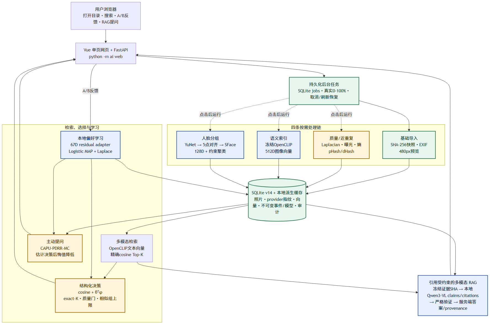
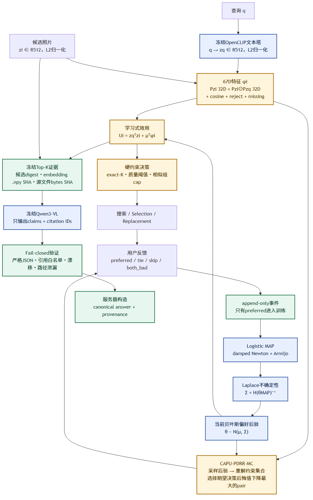

# Norma 多模态照片系统：实现、算法与面试讲解

> 适用版本：SQLite schema v14，默认 multilingual OpenCLIP，YuNet + SFace，67D Bayesian contextual preference，CAPU-PDRR-MC，以及本地 Qwen3-VL Grounded RAG。
> 这份文档的目标不是堆名词，而是让你能从一次真实请求出发，解释数据经过了哪些模块、为什么这样设计、哪里发生了学习、哪些地方仍是规则，以及实验能支持到什么程度。
## 0. 先用一分钟说清项目

Norma 是一个本地优先的智能照片整理网页。 用户用一条命令启动：
```powershell
python -m ai web
```
随后打开：
```text
http://127.0.0.1:8765
```
用户选择本地照片目录后，系统先快速完成目录发现、元数据读取和缩略图生成。 质量分析、语义索引和人脸分组都由用户点击按钮后才运行。 搜索时，冻结的 multilingual OpenCLIP 把中文或英文查询与照片映射到同一个 512 维向量空间。 用户的 A/B 选择会训练一个本地 67 维 Bayesian contextual residual adapter。 这个小模型会影响搜索、结构化选片、替换和 RAG 检索排序。 CAPU-PDRR-MC 利用后验不确定性，选择最可能降低最终选片决策后悔值的 A/B 问题。 Grounded RAG 先检索 Top-K 原图，再把真实像素交给本地 Qwen3-VL。 模型只允许返回 claims 和 citation IDs；最终答案与 provenance 由服务器构造并严格验证。
### 0.1 哪些是学习算法，哪些不是

| 模块 | 类型 | 是否在 Norma 内训练 | 面试时怎么说 |
|---|---|---:|---|
| multilingual OpenCLIP | 预训练多模态模型 | 否，冻结推理 | 学习式跨模态表征 |
| YuNet | 预训练人脸检测 | 否，冻结推理 | 学习式检测器 |
| SFace | 预训练人脸识别表征 | 否，冻结推理 | 学习式 128D identity embedding |
| Qwen3-VL-2B | 预训练视觉语言模型 | 否，冻结推理 | 本地多模态生成器 |
| 67D preference adapter | Bayesian pairwise 模型 | 是，本地反馈在线更新 | 项目中真正会学习用户偏好的模块 |
| CAPU-PDRR-MC | Bayesian active acquisition | 不直接训练模型 | 用后验不确定性决定下一题问什么 |
| 质量评分 | 手工图像特征 + 规则加权 | 否 | 可解释 baseline，不是 learned IQA |
| pHash/dHash | 感知哈希 | 否 | 近重复检测，不是语义检索 |
| 人脸约束聚类 | 确定性聚类 | 否 | 使用 learned embedding 的规则决策层 |
| exact-K / group cap | 组合优化约束 | 否 | 硬业务约束，不应伪装成学习 |
### 0.2 不能说成什么

- 不是 DPO。
- 不是 SFT。
- 不是 LoRA。
- 没有微调 OpenCLIP、Qwen、YuNet 或 SFace。
- 不是“所有模块都是深度学习”。
- RAG 的校验器不证明 claim 被图片语义蕴含。
- SQLite 的 append-only 约束不是外部签名的密码学账本。
最诚实的一句话是：
> Norma 把冻结的多模态基础模型、可解释的本地 Bayesian 偏好学习、决策感知主动提问、硬约束选片和引用受约束的本地多模态 RAG 组合成了一条可审计的照片工作流。
## 1. 系统总览


图中蓝色模块使用预训练模型或本地学习模型。 黄色模块是传统算法与确定性决策。 绿色模块负责快照、缓存、持久化与审计完整性。
### 1.1 目录结构对应关系

| 责任 | 主要代码 |
|---|---|
| 命令行与网页启动 | `ai/cli.py`、`ai/__main__.py` |
| HTTP API | `ai/app.py`、`ai/schemas.py` |
| SQLite 与迁移 | `ai/storage.py` |
| 持久化后台任务 | `ai/jobs.py` |
| 相册扫描 | `ai/index/scanner.py` |
| 质量与近重复 | `ai/index/quality.py`、`ai/index/similarity.py` |
| OpenCLIP provider | `ai/index/openclip_provider.py`、`ai/index/openclip_identity.py` |
| 向量索引与检索 | `ai/retrieval/search.py` |
| 人脸 provider 与聚类 | `ai/people/provider.py`、`ai/people/indexer.py` |
| 偏好特征与训练 | `ai/preferences/contextual.py`、`ai/preferences/service.py` |
| 运行时打分 | `ai/preferences/runtime.py` |
| 主动提问 | `ai/preferences/acquisition.py`、`suggestion_service.py` |
| 结构化选择与替换 | `ai/selection/service.py`、`replacement.py` |
| Grounded RAG | `ai/rag/service.py`、`engine.py`、`providers.py` |
| Qwen 本地运行时 | `ai/rag/transformers_runtime.py` |
| Vue 网页 | `src/App.vue`、`src/styles.css` |
### 1.2 一次请求如何经过系统

以查询“夜晚的城市建筑”为例：

1. Vue 将查询发送到 FastAPI。
2. OpenCLIP 文本塔生成 512D 单位向量。
3. 检索服务读取相册中当前 provider 对应的 512D 图像向量。
4. 精确点积得到 cosine 分数。
5. 如果本地存在兼容的 67D 偏好后验，再加入 preference residual。
6. Search 返回排序结果。
7. Selection 在同一 learned utility 上叠加 exact-K、质量门和相似组上限。
8. RAG 则冻结 Top-K 的候选摘要、embedding `.npy` SHA 和原始文件 bytes SHA。
9. Qwen3-VL 读取真实图像，只返回 claims 与 citations。
10. 服务端验证引用白名单和所有 provenance，再构造规范答案。
## 2. 启动、配置与本地边界

### 2.1 启动命令为什么是 `python -m ai web`

`python -m ai` 会执行包的 `__main__.py`，再进入 CLI。 `web` 子命令启动 Uvicorn 和 FastAPI。 这也是为什么下面的命令是错误的：
```powershell
python-m -ai web
```
PowerShell 会把 `python-m` 当作一个不存在的命令。 正确写法中 `python`、`-m`、`ai`、`web` 之间都有空格。
### 2.2 为什么默认只监听 127.0.0.1

系统处理本地照片、人脸 embedding 和偏好事件。 当前 API 没有登录认证。 因此默认安全模型是可信本机、单进程、loopback 服务。 不能直接把它绑定到 `0.0.0.0` 后公开到局域网或互联网。 派生图片访问也只开放两类 JPEG 路由：

- `/media/thumbnails/{album_id}/{filename}`
- `/media/faces/{provider}/{album_id}/thumbnails/{filename}`
数据库、OpenCLIP `.npy`、SFace descriptor 和任意非 JPEG 文件都不应由 HTTP 暴露。
### 2.3 Windows 数值运行时问题

Anaconda NumPy 与 PyTorch 可能各自加载一套 Intel OpenMP。 这不是普通 Python 异常，而可能直接 native abort。 Norma 在 `ai` 最早入口选择 `MKL_THREADING_LAYER=SEQUENTIAL`。 OpenCLIP/Qwen 加载前还会拒绝：

- 显式非 `SEQUENTIAL`；
- truthy `KMP_DUPLICATE_LIB_OK`；
- 已加载的 `mkl_intel_thread*.dll`；
- 非 Torch 来源的第二份 `libiomp5md.dll`。
如果宿主程序先导入了不兼容的 NumPy backend，再导入 Norma，系统会 fail closed。 它不会假装能在同一进程中安全卸载原生 DLL。
## 3. 相册导入：先快后重

### 3.1 为什么打开目录不自动跑所有模型

早期版本把扫描、质量、embedding 和人脸串成一个长任务。 对上千张照片，用户会长时间停在“Preparing locally”。 当前网页打开目录时发送：
```json
{
  "include_quality": false,
  "include_embeddings": false,
  "include_people": false
}
```
因此关键路径只做：

- 发现 JPG/JPEG；
- 读取 EXIF 方向、尺寸和拍摄时间；
- 计算源 SHA-256；
- 生成最长边 480 的 JPEG 预览；
- 写入 SQLite 相册快照。
质量、语义和人脸都由按钮单独启动。 这是一种 progressive computation 设计。
### 3.2 稳定 ID

相册和照片使用 UUIDv5，而不是随机 UUIDv4。 相册 ID 由规范化目录路径派生。 照片 ID 由相册 ID 与源路径派生。 因此同一目录重复导入会得到稳定 ID。 稳定 ID 对以下功能非常重要：

- 缓存复用；
- 相关性标注；
- preference event；
- selection audit；
- RAG citation。
### 3.3 并发扫描

`AlbumIndexer` 默认最多 4 个 worker。 in-flight future 被限制在 `2 × workers`。 这样不会一次性提交 1400 个 Future。 worker 只做单张图片处理，不访问 SQLite，也不写 job 状态。 主线程负责：

- 恢复原始路径顺序；
- 更新进度；
- 检查取消；
- 最终持久化。
所以并行完成顺序不会改变数据库顺序或测试结果。
### 3.4 ABA 与源文件快照

只比较 size 和 mtime 不够。 攻击者或外部程序可以替换文件内容，再恢复相同大小和时间戳。 Norma 同时绑定：
```text
source_size + source_mtime_ns + source_sha256
```
图片读取前后还会再次检查 stat。 如果文件在解码期间变化，本次结果不会提交。
### 3.5 旧图暂时损坏时为什么不删除数据库行

相机复制未完成、网络盘短暂不可读或 JPEG 被部分写入时，扫描可能失败。 如果路径仍存在且数据库里有上一份完整记录，系统保留旧快照并报告错误。 只有目录中真正缺失的成员才被视为删除。 这避免一次暂时性 I/O 错误级联删除：

- photo row；
- embedding；
- faces；
- relevance judgment；
- selection provenance。
### 3.6 复杂度

设目录项数为 $E$，总源文件字节为 $B$，图片像素数为 $P_i$。 目录发现约为：
<div class="math-display">$$ O(E) $$</div>
完整 SHA 校验约为：
<div class="math-display">$$ O(B) $$</div>
首次解码与缩略图约为：
<div class="math-display">$$ O\left(\sum_i P_i\right) $$</div>
缓存命中会省掉部分解码和派生计算，但为了内容完整性仍可能读取完整文件做 SHA。
## 4. SQLite 后台任务、进度与取消

### 4.1 为什么 job 必须持久化

如果任务状态只放在 Python 内存：

- 刷新网页后进度消失；
- 服务重启后不知道任务到哪里；
- 无法审计失败阶段；
- cancel/completed 竞态难以处理。
Norma 将 job 状态写入 SQLite。 主要字段包括：

- status；
- stage；
- progress；
- completed_units；
- total_units；
- cancel_requested；
- result_json；
- error；
- created/started/finished 时间。
### 4.2 外层串行，内层有界并发

`PrepareJobManager` 的外层线程池只有一个 worker。 所以不会同时对同一块磁盘启动多个重型相册任务。 AlbumIndexer 内部仍可使用最多 4 个线程并行处理照片。 这是两层并发控制：
```text
任务级：1
照片级：≤4
```
### 4.3 百分比不是前端假动画

后端回调提供真实 `completed/total`。 前端每 650 ms 轮询一次 job。 进度写 SQLite 做了节流，避免每张图都产生一次事务。 典型触发条件：

- 已完成；
- 至少前进 5%；
- 经过 0.25 秒心跳；
- 或前进至少 1% 且至少经过 0.05 秒。
### 4.4 取消语义

取消是 cooperative cancellation，不是强杀线程。 系统在以下边界检查：

- 照片之间；
- embedding batch 之间；
- 分析阶段之间；
- 数据库提交前。
正在运行的一张图或一个模型 batch 会先结束。 相册完整快照只有在全部扫描成功且提交前未取消时才替换旧数据库状态。
### 4.5 重启语义

服务重启后：

- queued job 会重新排队；
- 之前 running 的 job 会标记为 interrupted/failed；
- 不会伪造“从任意 Python 栈位置继续”。
前端 localStorage 只保存活跃 job ID。 SQLite 才是真相源。
## 5. 质量评分：可解释 baseline

### 5.1 特征

图片最长边先缩到 768。 系统提取：

- Laplacian 方差：清晰度；
- 灰度均值：亮度；
- 灰度标准差：对比度；
- 像素值 ≥250：过曝比例；
- 像素值 ≤5：欠曝比例；
- 256-bin 灰度熵：信息量；
- 原图最长边：分辨率。
### 5.2 评分公式

五个 component 都映射到 \([0,1]\)。
<div class="math-display">$$ Q=100(0.36S+0.23E+0.17C+0.14H+0.10R) $$</div>
其中：

- $S$：sharpness；
- $E$：exposure；
- $C$：contrast；
- $H$：entropy；
- $R$：resolution。
### 5.3 auto_reject 的含义

只有这些严重信号会触发 auto_reject：

- very_blurry；
- underexposed；
- overexposed；
- low_information。
它不会删除原图。 它只是 UI 折叠和结构化选择的硬门控信号。
### 5.4 为什么不把它说成 learned IQA

权重和阈值由工程规则设定，没有训练数据和 optimizer。 它无法理解“艺术性虚化”“刻意剪影”“高调摄影”。 求职项目中正确说法是：
> 我保留了一个便宜、可解释的规则 baseline；下一步会用 learned IQA/aesthetic 模型做同一公开协议下的 ablation，而不是把规则结果包装成深度学习。
## 6. pHash/dHash 近重复

### 6.1 pHash

1. 转灰度。
2. resize 到 32×32。
3. 做二维 DCT。
4. 取左上 8×8 低频块。
5. 以中位数二值化为 64 bit。
### 6.2 dHash

1. 转灰度。
2. resize 到 9×8。
3. 比较每行相邻像素。
4. 得到 64 bit。
### 6.3 双阈值与并查集

两张照片只有同时满足：
```text
pHash Hamming ≤ 7
dHash Hamming ≤ 9
```
才建立边。 所有边用 union-find 合成 connected components。 单例不生成 similarity group。
### 6.4 复杂度与缺点

全量两两比较是：
<div class="math-display">$$ O(N^2) $$</div>
它适合个人相册规模，但不适合百万级图库。 并查集还有 single-link 链风险：
```text
A 接近 B
B 接近 C
A 未必接近 C
```
未来可以用 LSH/BK-tree 先召回候选，再做严格 pairwise 验证。
## 7. 人脸：YuNet + SFace + 约束聚类

### 7.1 为什么旧 Haar + DCT 效果差

旧实现的问题不是把阈值从 0.985 改成 0.95 就能解决。 根因有三层：

1. Haar frontal detector 对侧脸、低头、远景和遮挡召回差。
2. 79D DCT/HSV 是手工外观描述，不是身份 embedding。
3. single-link 聚类既会严重拆分，也可能被桥接误合并。
所以正确升级顺序是先换检测与表征，再重做聚类。
### 7.2 新管线

1. EXIF 校正并转 RGB。
2. 检测图最长边限制到 1600。
3. YuNet 检测 bbox、置信度与五点 landmarks。
4. score threshold 为 0.8，NMS 为 0.3。
5. 坐标映射回原图。
6. SFace `alignCrop` 做五点对齐。
7. 输出 128D descriptor。
8. 对 descriptor 做 L2 normalization。
9. 保存 JPEG face preview 与 `.npy` descriptor。
### 7.3 模型身份

provider fingerprint 包含：

- YuNet 版本与 SHA；
- SFace 版本与 SHA；
- `align112-v1`；
- 聚类 policy version。
模型或预处理变化时，旧缓存不会继续显示 ready。
### 7.4 第一阶段受约束凝聚

设每张脸单位向量为 $f_i\in\mathbb R^{128}$。 余弦矩阵：
<div class="math-display">$$ S_{ij}=f_i^\top f_j $$</div>
候选 pair 至少满足：
<div class="math-display">$$ S_{ij}\ge 0.45 $$</div>
合并两个 cluster 前，必须同时满足：

1. 两簇不包含来自同一照片的脸；
2. 跨簇最小相似度 ≥0.45；
3. 跨簇平均相似度 ≥0.45；
4. 两个质心的 cosine ≥0.45。
这阻止 A≈B、B≈C 造成 A/C 被 single-link 强行串起来。
### 7.5 prototype attachment

第一阶段优先精度，可能把同一人的姿态差异拆开。 第二阶段用互为最佳 prototype 做保守附着。 多样本簇阈值：
```text
centroid ≥ 0.40
mean     ≥ 0.30
max      ≥ 0.42
```
涉及单例时更严格：
```text
centroid ≥ 0.42
mean     ≥ 0.36
max      ≥ 0.48
```
每次合并后重新计算证据。 仍然保留 same-photo cannot-link。
### 7.6 为什么不用 K-means

K-means 要预先知道人数 $K$。 个人相册通常不知道有多少人。 K-means 也不能自然表达 same-photo cannot-link。 当前方法优先保证：

- 不知道簇数也能运行；
- 结果确定；
- 规则可审计；
- 降低误合并风险。
### 7.7 边界

- 阈值仍是固定策略，不是用户训练出来的。
- same-photo cannot-link 会拆开镜像、拼图或同一人重复曝光。
- 大型活动相册的完整相似矩阵会带来 $O(F^2)$ 内存。
- 输出是 Unknown cluster，不做人名识别。
- 它不是安防级生物识别系统。
## 8. multilingual OpenCLIP 检索

### 8.1 为什么选 multilingual OpenCLIP

普通 CLIP 文本塔主要面向英文。 Norma 的默认 provider 使用 XLM-R 文本塔与 ViT-B/32 图像塔。 原始中文查询直接进入模型。 旧关键词翻译 bridge 只保留为显式 ablation。 它不再是默认路径。
### 8.2 归一化与 cosine

对图像 $I_i$：
<div class="math-display">$$ z_i=\frac{f_I(I_i)}{\|f_I(I_i)\|_2} $$</div>
对查询 $q$：
<div class="math-display">$$ z_q=\frac{f_T(q)}{\|f_T(q)\|_2} $$</div>
两者都是单位向量，因此：
<div class="math-display">$$ s_i=z_q^\top z_i=\cos(z_q,z_i) $$</div>
### 8.3 为什么现在不用向量数据库

当前个人相册通常是几百到几千张。 精确扫描的复杂度约为：
<div class="math-display">$$ O(Nd+N\log N),\quad d=512 $$</div>
优点：

- 没有 ANN recall 损失；
- 排序确定；
- provider drift 容易检查；
- 不需要额外服务和索引生命周期。
百万级照片时才适合切换 FAISS/HNSW，并报告 Recall@K 与延迟权衡。
### 8.4 provider fingerprint

OpenCLIP identity 不只是一个友好的模型名。 它绑定：

- 固定模型 revision；
- 权重、tokenizer 和 config 的完整 SHA；
- preprocess contract；
- raw multilingual query contract；
- CPU/CUDA backend；
- 直接影响输出的 Python runtime versions；
- Windows numeric threading contract。
不同 identity 的向量不能混用。
### 8.5 fail-closed 本地加载

首次加载流程：

1. 强制 Hugging Face/Transformers offline。
2. 校验 closed-world 文件集合。
3. 校验大小和完整 SHA。
4. 强制 config 与 tokenizer 从已验证的本地 snapshot 读取。
5. `local_files_only=True`。
6. `trust_remote_code=False`。
7. 加载后再做一次完整校验。
8. 最后才发布 model instance。
缓存缺失或不一致时返回 unavailable。 不会偷偷切换到 lightweight 手工特征。
### 8.6 已有旧相册为什么提示重新索引

旧数据库中的照片可能仍绑定 `lightweight-semantic-v1` 或旧 raw-v2 fingerprint。 代码默认切换到新的 pinned OpenCLIP 后，provider mismatch 会让 readiness 归零。 这是正确行为。 用户需要点击一次“语义索引”生成当前 512D cache。
## 9. 67D Bayesian contextual preference


### 9.1 为什么不直接微调 OpenCLIP

本地用户反馈通常很少。 直接微调大模型会遇到：

- 样本不足；
- 过拟合；
- CPU 成本高；
- 模型版本和回滚复杂；
- 隐私与审计困难。
因此 Norma 冻结 OpenCLIP，只学习小型 residual adapter。
### 9.2 67 维从哪里来

固定投影：
<div class="math-display">$$ P\in\mathbb R^{32\times512} $$</div>
特征：
<div class="math-display">$$ \phi(z_i,z_q)= [Pz_i,\;(Pz_i)\odot(Pz_q),\;z_i^\top z_q,\;r_i,\;m_i] \in\mathbb R^{67} $$</div>
维度拆分：
```text
0..31   图像投影 Pzi
32..63  图文交互 Pzi ⊙ Pzq
64      OpenCLIP cosine
65      auto_reject
66      quality_missing
```
其中投影矩阵由固定算法生成并版本化。 同一输入在不同运行中得到相同特征。
### 9.3 学习式 utility

<div class="math-display">$$ U_i=z_q^\top z_i+\theta^\top\phi_i $$</div>
第一项是 OpenCLIP base score。 第二项是用户偏好 residual。 零反馈时令 \(\theta=0\)，于是严格退化为原始 cosine。 这很重要，因为系统没有反馈时不应该凭空改变基础模型排序。
### 9.4 pairwise likelihood

用户选择 $i$ 而拒绝 $j$。 定义：
<div class="math-display">$$ x_n=\phi_i-\phi_j $$</div>
<div class="math-display">$$ b_n=cos_i-cos_j $$</div>
margin：
<div class="math-display">$$ m_n=b_n+x_n^\top\theta $$</div>
Bradley-Terry / logistic 概率：
<div class="math-display">$$ P(i\succ j)=\sigma(m_n) $$</div>
### 9.5 MAP 目标

使用零均值 isotropic Gaussian prior：
<div class="math-display">$$ \theta\sim\mathcal N(0,\lambda^{-1}I) $$</div>
默认 \(\lambda=1\)。 负对数后验：
<div class="math-display">$$ F(\theta)= \sum_n softplus(-m_n)+\frac{\lambda}{2}\|\theta\|_2^2 $$</div>
梯度：
<div class="math-display">$$ g=X^\top(\sigma(m)-1)+\lambda\theta $$</div>
Hessian：
<div class="math-display">$$ H=X^\top diag(\sigma(m)(1-\sigma(m)))X+\lambda I $$</div>
### 9.6 优化与 Laplace

训练使用 full-batch damped Newton。 每一步解：
<div class="math-display">$$ H\Delta=-g $$</div>
再用 Armijo line search 确保目标下降。 MAP 点得到 \(\theta_{MAP}\)。 Laplace covariance：
<div class="math-display">$$ \Sigma=H(\theta_{MAP})^{-1} $$</div>
代码用 Cholesky 求解并对称化。 后验近似：
<div class="math-display">$$ \theta\mid D\approx\mathcal N(\theta_{MAP},\Sigma) $$</div>
### 9.7 事件语义

choice 有四种：
```text
preferred
tie
skip
both_bad
```
只有 `preferred` 进入二元 posterior 训练。 另外三种仍写不可变事件和审计。 不能为了增加样本量，把 tie 强行随机改成 preferred。
### 9.8 不可变事件与模型版本

`preference_events` 使用 SQLite trigger 禁止 UPDATE 和 DELETE。 `preference_models` 保存每次训练的版本化快照。 同一 user、provider 和 feature schema 只能有一个 active model。 旧模型只允许从 active=1 退为 0。 加载模型时会重算训练事件 digest，并检查：

- algorithm；
- provider；
- feature schema；
- projection ID；
- dimension；
- prior；
- covariance；
- event count 与 digest。
不兼容时 fail closed 或显式回退 cosine。
### 9.9 为什么这不是 DPO

DPO 要比较 chosen/rejected 生成序列，并计算 policy/reference model 的 token log-prob。 Norma 没有：

- Qwen token log-prob；
- reference LLM；
- backward；
- optimizer 更新大模型权重。
Norma 的监督对象是“用户更喜欢哪张照片”。 训练对象是 67D logistic posterior。 所以正确名称是 pairwise Bayesian contextual preference learning。
## 10. CAPU-PDRR-MC 主动提问

### 10.1 为什么 entropy 不够

常见主动学习会选预测最不确定的 pair。 但“最不确定”不等于“最影响最终选片集合”。 两个都不会入选的差照片即使胜负很不确定，也可能没有决策价值。 PDRR 直接估计问这个 pair 后，最终受约束决策的后悔值能降低多少。
### 10.2 当前决策

目标是选出集合 $A$。 约束包括：
```text
|A| = K
每个 similarity group 至多 cap 张
```
对 posterior sample \(\theta_b\)：
<div class="math-display">$$ U_{bi}=cos_i+\theta_b^\top\phi_i $$</div>
每个 sample 的 oracle action：
<div class="math-display">$$ A_b^*=\arg\max_A\sum_{i\in A}U_{bi} $$</div>
当前 posterior mean action：
<div class="math-display">$$ A_0=\arg\max_A\sum_{i\in A}\mathbb E[U_i] $$</div>
当前 Bayes regret：
<div class="math-display">$$ R_0=\mathbb E_b[V_b(A_b^*)-V_b(A_0)] $$</div>
### 10.3 shortlist

全部 pair 数约为：
<div class="math-display">$$ M=\frac{N(N-1)}{2} $$</div>
系统先用便宜分数 shortlist：
<div class="math-display">$$ H(\mathbb E_b[\sigma(U_{bi}-U_{bj})]) \times Var_b(1[i\in A_b^*]-1[j\in A_b^*]) $$</div>
第一项衡量 pair outcome entropy。 第二项衡量 pair 是否会改变最终集合 membership。 默认只对前 16 个 pair 做完整 PDRR 评估。
### 10.4 完整 PDRR

对 left/right 两个 hypothetical outcome：

1. 重要性重加权 posterior samples；
2. 计算 ESS；
3. 必要时做 rank-one Laplace update；
4. 重新求解受约束集合；
5. 得到 outcome 后的 regret。
<div class="math-display">$$ PDRR= \max(0,R_0-p_LR_L-(1-p_L)R_R) $$</div>
选择 PDRR 最大的 shortlist pair。
### 10.5 数值稳定性

默认 posterior sample 数 \(B=64\)。 ESS 阈值：
<div class="math-display">$$ \min(0.25B,16) $$</div>
低 ESS 走 rank-one Laplace fallback。 如果所有 pair 的 raw VOI 都低于 `-1e-8`，服务最多重试一次：默认把 $B$ 从 64 提高到 128，且不超过 4096。 仍不稳定就 abstain，而不是伪造一个建议。
### 10.6 复杂度

设特征维 \(D=67\)，候选数 \(N\)，样本数 \(B\)，pair 数 \(M\)，shortlist 长度 \(L\)。 主要复杂度近似：
<div class="math-display">$$ O(D^3+BD^2+BDN+BN\log N+MB+M\log M+LN\log N) $$</div>
内存约为：
<div class="math-display">$$ O(BN+ND+M) $$</div>
### 10.7 科研 claim 边界

受控半合成实验中，PDRR 在 feedback budget=10 时相对 random 和 entropy 显示探索性优势。 budget=30/60 的区间跨 0。 因此只能说：
> PDRR 在这个受控协议的低预算阶段具有值得继续验证的决策感知信号。
不能说：
> PDRR 在所有预算、所有用户和真实场景都优于 entropy。
## 11. Search、Selection 与 Replacement

### 11.1 Search

Search 对每张候选计算：
```text
semantic_score = cosine
preference_residual = μᵀφ
utility_score = semantic_score + preference_residual
```
API 分开返回 base score 与 residual。 这样可以解释排序变化来自哪里。
### 11.2 Selection

学习模型只给 utility。 硬约束仍由确定性求解器执行。 典型约束：

- exact-K；
- minimum quality；
- exclude rejects；
- similarity group cap。
质量、reject 和 group cap 不会被 preference model 软化。
### 11.3 为什么硬约束不交给模型

“最多选 10 张”是产品合同，不是统计偏好。 “近重复组最多一张”也是明确业务规则。 如果让模型以 penalty 近似，可能出现违反约束的结果。 因此架构是：
```text
learned utility + deterministic constraints
```
### 11.4 Replacement

替换一张照片时：

1. 锁定其它已选照片；
2. 读取一个当前 provider/model snapshot；
3. 同时重算 locked items 与 replacement candidates；
4. 保持原始约束；
5. 选最高 utility 的可行候选。
不能把旧模型分数的 locked items 与新模型候选分数直接混合。
### 11.5 决策快照

Selection audit 保存：

- user；
- raw query；
- provider fingerprint；
- model ID；
- comparison count；
- candidate universe digest；
- query-dependent 67D feature digest；
- algorithm version。
反馈前会重算 digest。 候选向量被无声替换时返回 409，不写训练事件。
## 12. Grounded multimodal RAG

### 12.1 为什么它是真 RAG

实际流程是：
```text
query
→ OpenCLIP 检索本地相册
→ 偏好后验重排
→ 读取 Top-K 原图
→ Qwen3-VL 生成
→ 引用验证与答案构造
```
生成模型参数之外的本地照片库在请求时被检索并注入。 所以它属于 multimodal RAG。
### 12.2 三层绑定

#### 候选层

绑定全相册：

- photo IDs；
- provider；
- source size/mtime/SHA；
- embedding SHA；
- quality/reject；
- preference model 与 event digest。
#### 检索层

RetrievalService 必须读取快照指定 SHA 的 frozen vectors。 检索前后重建候选摘要。 变化则 409。
#### 证据层

Top-K 原图读取为 immutable bytes。 每张图计算 SHA。 这个 SHA 必须等于生成 embedding 时记录的源内容 SHA。 因此不会出现：
```text
排序用图片A的向量
Qwen看到被替换后的图片B
```
### 12.3 prompt 信任边界

prompt 被分为：

- system security rules；
- trusted control JSON；
- task query JSON；
- untrusted evidence JSON。
文件名、OCR、caption 和图中文字都被视为不可信数据。 本地路径会脱敏。
### 12.4 模型输出合同

Qwen 只能返回：
```json
{
  "claims": [
    {"claim_id": "c1", "text": "..."}
  ],
  "citations": [
    {"claim_id": "c1", "photo_id": "..."}
  ]
}
```
模型不能定义 authoritative answer。 模型也不能定义 provenance。
### 12.5 严格解析与校验

系统拒绝：

- 多个 JSON fence；
- fence 外散文；
- 重复 JSON key；
- extra key；
- NaN/Infinity；
- 重复 claim ID；
- 无 citation 的 claim；
- 引用 Top-K 外 photo ID；
- 重复 claim/photo pair；
- 本地路径泄露；
- 生成期间的候选、向量或像素漂移。
最终 answer 由服务器按 claim/citation 规范渲染。
### 12.6 Qwen 本地运行时

关键设置：

- Qwen3-VL-2B-Instruct；
- 固定 revision 与 closed-world manifest；
- CPU-only；
- local files only；
- trust remote code false；
- eval；
- do_sample false；
- temperature 0；
- max_new_tokens 默认 256。
provider fingerprint 绑定：

- 模型与资产 SHA；
- runtime/preprocess version；
- prompt contract SHA；
- generation token budget；
- 直接影响输出的 Python distributions；
- numeric threading contract。
### 12.7 图像预算

单请求 Top-K 最大为 6。 安全限制包括：

- 单图 ≤64 MP；
- 总图像 ≤96 MP；
- 编码字节总量 ≤128 MiB；
- preflight visual tokens ≤3840；
- processor 后 hard cap ≤4096。
缩放只用于模型输入副本。 证据 identity 仍绑定原始 bytes SHA。
### 12.8 并发

进程级 nonblocking admission lock 保证同一时间只有一个 RAG 请求进入重型阶段。 第二个并发请求返回 429。 runtime 内部还有 generation lock。 这是单进程保证。 多 Uvicorn worker 需要外部队列或跨进程锁。
### 12.9 它没有解决什么

校验器证明：

- citation ID 在 allow-list；
- provenance 与快照一致；
- 模型没有越权构造服务器字段。
校验器不证明：

- claim 一定被像素支持；
- claim 没有视觉误读；
- answer 没有语义幻觉。
如果要进一步解决，需要 learned visual entailment verifier 或人工评估集。
## 13. SQLite v14 与审计

### 13.1 重要表

| 表 | 作用 |
|---|---|
| albums/photos | 相册与照片快照 |
| jobs | 持久化后台任务 |
| embeddings | 通过 photos 字段绑定 provider/source/cache |
| faces/person_clusters | 人脸 descriptor 与分组 |
| relevance_* | 检索人工标注与评估 |
| preference_events | append-only 用户反馈 |
| preference_models | 版本化后验模型 |
| preference_suggestions | PDRR 建议与消费状态 |
| selections | 可回放选片决策 |
| rag_runs | 不可变 RAG 审计 |
### 13.2 迁移思路

当前 schema 版本为 14。 重要迁移包括：

- v9：重建 photos，支持父目录/子目录相册重叠；
- v10：不可变 preference event/model；
- v11：suggestion one-shot 与 event 唯一关联；
- v12：RAG audit；
- v13：embedding source SHA；
- v14：rag_runs 改为 WITHOUT ROWID。
表重建迁移会：

1. 开启事务；
2. 建新表；
3. 复制数据；
4. 核对行数；
5. 重建索引/trigger；
6. 做 foreign key check；
7. 成功后记录 migration version。
### 13.3 为什么 rag_runs 用 WITHOUT ROWID

普通 rowid 表可以出现针对 rowid 的 `INSERT OR REPLACE` 绕过风险。 以 id 作为 WITHOUT ROWID 主键后，再配合 trigger：

- 禁 UPDATE；
- 禁 DELETE；
- 禁重复 ID replace。
这强化了 SQLite 内的 append-only 约束。 但拥有数据库文件权限的人仍能复制、替换整个 DB。 因此它不是外部不可篡改日志。
## 14. 实验结果怎么讲

### 14.1 OpenCLIP proxy

固定公开代理实验的中文 macro 指标：
| Provider | Precision@10 | Recall@20 | nDCG@10 | nDCG@20 |
|---|---:|---:|---:|---:|
| lightweight rules | 0.667 | 0.384 | 0.709 | 0.539 |
| legacy bridge | 0.667 | 0.576 | 0.733 | 0.710 |
| raw multilingual v2 | 0.733 | 0.605 | 0.801 | 0.753 |
raw multilingual 的 nDCG@20 相对 lightweight 增加 0.214。 相对 legacy bridge 增加约 0.044。 这是固定 proxy、查询数小、没有置信区间的结果。 不能泛化成所有相册上的总体优势。
### 14.2 contextual preference 受控实验

70 张 Wikimedia 公开图。 每个 seed 为 42 train / 28 test，严格文件级不重叠。 10 seeds × 3 个受控模拟用户。 budget 为 0/10/30/60。 budget=60 的均值：
| 方法 | log loss ↓ | order accuracy ↑ | set regret/photo ↓ |
|---|---:|---:|---:|
| zero cosine | 0.693718 | 0.606085 | 0.380869 |
| random feedback | 0.629845 | 0.693915 | 0.057889 |
| entropy feedback | 0.627782 | 0.697531 | 0.052210 |
random 与 entropy 相对 zero 的 paired bootstrap 区间支持改善。 entropy 与 random 的区间跨 0。 因此不能声称 entropy 稳定优于 random。
### 14.3 PDRR 受控实验

budget=10 时，PDRR 相对 random 的改善：

- log loss：+0.0213，CI [0.0107, 0.0324]；
- accuracy：+5.24 pp，CI [1.70, 8.83]；
- regret/photo：+0.1131，CI [0.0436, 0.1888]。
相对 entropy：

- log loss：+0.0271，CI [0.0160, 0.0374]；
- accuracy：+8.02 pp，CI [3.39, 12.55]；
- regret/photo：+0.1551，CI [0.1176, 0.1931]。
但 budget=30/60 的区间跨 0。 所以主张必须限定为低预算探索性优势。
### 14.4 Qwen functional smoke

单机两次同进程 smoke：

- 第一次生成约 48.05 s；
- 第二次约 25.87 s；
- peak RSS 约 4.94 GiB（5.31 GB）。
这证明 pinned local runtime 和严格输出合同可运行。 它不是延迟 benchmark 的统计结论。 它也不证明答案准确率或幻觉率。
### 14.5 数据可复现性边界

Wikimedia thumbnail URL 会发生 renderer/cache 漂移。 72 个 URL 审计中：

- 58/72 raw bytes exact；
- 10/72 raw 漂移但 decoded RGB exact；
- 4/72 decoded pixels 也漂移。
因此当前下载器会 fail closed，但不能声称普通 URL 足以重建历史实验输入。 完整复现需要：

- 许可完整的 content-addressed archive；或
- 固定不可变 revision URL；或
- 使用新 experiment ID 重跑。
## 15. 目前有了什么，还差什么

### 15.1 已完成

- Web-only 本地应用与 `python -m ai web`。
- SQLite v14 数据模型和持久化 job。
- 按需质量、语义、人脸按钮与真实百分比。
- pinned raw multilingual OpenCLIP 512D 检索。
- YuNet + SFace learned face pipeline。
- constrained face clustering。
- 67D Bayesian contextual preference learning。
- Search / Selection / Replacement 统一消费 learned utility。
- one-shot preference suggestions 与不可变事件。
- CAPU-PDRR-MC 主动提问。
- pinned local Qwen3-VL multimodal RAG。
- evidence/candidate/embedding/source SHA 绑定。
- strict claims/citations validator。
- 科研图、受控实验、原始 JSON 和完整性审计。
- Windows NumPy/Torch OpenMP 冲突的 fail-closed 修复。
### 15.2 还没有

- 没有 DPO/SFT/LoRA。
- 没有真实用户长期在线实验。
- 没有 learned IQA/aesthetic 默认模型。
- 没有 learned reranker 的独立训练。
- 没有 visual entailment verifier。
- 没有 ANN/向量数据库。
- 没有多用户认证和远程部署安全层。
- 没有跨进程 Qwen 队列。
- 没有可公开下载的精确 72 图 content-addressed archive。
- 没有大规模人脸公开 benchmark 的完整报告。
### 15.3 下一步优先级

第一优先：真实用户评估。 需要收集：

- 用户是否更快找到照片；
- 经过 10/30/60 次反馈后的满意度；
- false merge / false split；
- RAG claim support rate；
- 真实 cold/warm latency 与峰值内存分布。
第二优先：learned quality/aesthetic 与 reranker ablation。 第三优先：visual entailment verifier。 第四优先：ANN 与大相册扩展。 第五优先：认证、跨进程队列和部署安全。
## 16. 面试讲解模板

### 16.1 30 秒版本

> Norma 是一个本地优先的多模态照片整理网页。我用 pinned multilingual OpenCLIP 做中英文图文检索，用 YuNet + SFace 做人脸表征；用户 A/B 反馈不是拿去微调大模型，而是训练一个 67D Bayesian contextual residual，用于 Search、Selection、Replacement 和 RAG retrieval。CAPU-PDRR-MC 根据最终 exact-K 选片决策的后悔值下降来挑下一组 A/B。RAG 把 Top-K 原图交给本地 Qwen3-VL，但模型只生成 claims/citations，服务器验证引用、源文件 bytes SHA 和 provenance 后才构造答案。整个系统强调本地隐私、缓存版本和可审计 claim boundary。
### 16.2 两分钟版本

先说产品痛点：本地照片多，用户不愿上传云端，传统关键词又不够。 再说架构：导入只生成预览；质量、OpenCLIP、人脸按需运行并落 SQLite job。 然后说学习：OpenCLIP/YuNet/SFace/Qwen 冻结；真正在线学习的是 67D pairwise Bayesian residual。 再说决策：learned utility 与 exact-K、质量门、近重复 cap 分离。 再说主动学习：PDRR 不只问最不确定 pair，而问最可能改变最终选片决策的 pair。 最后说 RAG：冻结候选、embedding 和原始文件 bytes；Qwen 只返回 claims/citations；服务器控制 answer/provenance。 收尾要主动讲边界：不是 DPO，没有微调，引用完整性不等于语义正确。
## 17. 面试题库

### ⭐ L1-1：这个项目到底用了哪些学习算法？

OpenCLIP、YuNet、SFace、Qwen3-VL 都是预训练模型的冻结推理。 项目内真正根据用户数据更新的是 67D Bayesian pairwise logistic preference model。 CAPU-PDRR-MC 使用该后验做主动提问，但自己不是神经网络训练。 质量、pHash/dHash、约束聚类和 exact-K 是传统算法。
### ⭐ L1-2：为什么说它不是纯规则系统？

因为语义检索、人脸检测、人脸 embedding 和多模态生成都来自 learned representations。 规则主要负责质量 baseline、近重复、硬约束和完整性校验。 系统是 learned models 与 deterministic guardrails 的组合。
### ⭐ L1-3：为什么说它不是 DPO？

DPO 要优化生成模型 policy，相对 reference model 使用 chosen/rejected 序列 log-prob。 Norma 不计算 Qwen token log-prob，也不反向传播。 它训练的是照片 pair 上的 67D logistic posterior。
### ⭐ L1-4：为什么使用 OpenCLIP？

它把文本和图像映射到统一向量空间。 multilingual 文本塔能直接处理中文。 相比有限关键词字典，它支持开放词汇检索。
### ⭐ L1-5：为什么归一化 embedding？

归一化后点积等于 cosine。 这样分数只反映方向相似度，不受向量模长影响。 也让零反馈排序定义清晰。
### ⭐ L1-6：为什么打开目录时不自动做人脸和语义索引？

模型推理是慢路径。 首屏只需要目录、元数据和缩略图。 拆成按需任务能显著改善首次体验，也便于独立取消、重试和缓存。
### ⭐ L1-7：质量评分是不是 AI？

当前默认质量评分不是学习模型。 它由 Laplacian、亮度、对比度、曝光、熵和分辨率规则加权。 它是可解释 baseline。
### ⭐ L1-8：RAG 为什么是真的 RAG？

系统先从 Qwen 参数之外的本地相册检索 Top-K，再把经过预算约束的 evidence images 输入 Qwen。 这包含 retrieval、augmentation 和 generation 三步。
### ⭐ L1-9：用户照片会上传吗？

默认不会。 模型、向量、数据库和生成都在本机。 但当前没有远程部署认证，所以只应监听 127.0.0.1。
### ⭐ L1-10：为什么不用 FAISS？

当前目标规模是个人相册，精确扫描更简单、确定、易审计且无 ANN recall 损失。 百万级规模时再引入 ANN，并测 Recall@K/latency/memory。
### ⭐⭐ L2-1：67D 是怎么组成的？

32D 图像固定投影，32D 图文逐元素交互，1D cosine，1D auto_reject，1D quality_missing。 总计 67D。
### ⭐⭐ L2-2：为什么 utility 还要保留 cosine？

preference model 被设计成 residual。 没有反馈时 \(\theta=0\)，utility 必须严格等于 OpenCLIP cosine。 这样不会在 cold start 时凭空改变排序。
### ⭐⭐ L2-3：MAP 的 prior 是什么？

<div class="math-display">$$ \theta\sim\mathcal N(0,\lambda^{-1}I) $$</div>
默认 \(\lambda=1\)。 等价于目标中的 L2 penalty，可抑制少量反馈下的过拟合。
### ⭐⭐ L2-4：Laplace covariance 有什么用？

它近似 MAP 附近的 posterior uncertainty。 PDRR 需要从 \(\mathcal N(\mu,\Sigma)\) 采样，估计不同参数下最优选片集合如何变化。
### ⭐⭐ L2-5：tie、skip、both_bad 为什么不训练？

当前 likelihood 是有方向的二元 preferred/rejected 模型。 tie 和 both_bad 需要不同 observation model。 强行映射会制造错误监督，所以只审计不训练。
### ⭐⭐ L2-6：PDRR 与 entropy 的区别？

entropy 问“哪一对胜负最不确定”。 PDRR 问“知道这对胜负后，最终受约束选片决策的 Bayes regret 能降低多少”。 它更贴近产品目标，但计算更贵。
### ⭐⭐ L2-7：人脸为什么不用 single-link？

single-link 会链式误合并。 当前合并要求跨簇 minimum、mean、centroid 三个证据同时过阈值，并加入 same-photo cannot-link。
### ⭐⭐ L2-8：如何防止模型升级后复用旧向量？

provider fingerprint 绑定模型资产、预处理、query contract、runtime ABI 和 backend。 照片 cache 还绑定源 size/mtime/SHA。 任一不匹配就不 ready。
### ⭐⭐ L2-9：RAG 如何防止向量与实际图片不一致？

embedding 建立时保存 source SHA。 RAG 读取 Top-K 源文件后重算 source bytes SHA，必须与 embedding source SHA 一致。 否则 409，不进入生成。
### ⭐⭐ L2-10：为什么硬约束不让 preference model 学？

exact-K 和 similarity cap 是必须满足的业务合同。 模型只提供 utility，确定性 solver 负责 feasibility。 这样任何反馈都不会导致非法集合。
### ⭐⭐⭐ L3-1：推导 pairwise MAP 的梯度与 Hessian。

单样本损失为：
<div class="math-display">$$ \ell_n=softplus(-(b_n+x_n^\top\theta)) $$</div>
令 \(p_n=\sigma(b_n+x_n^\top\theta)\)。 则：
<div class="math-display">$$ \nabla F=X^\top(p-1)+\lambda\theta $$</div>
<div class="math-display">$$ \nabla^2F=X^\top diag(p(1-p))X+\lambda I $$</div>
高斯 prior 让 Hessian 至少有 \(\lambda I\)，改善可逆性。
### ⭐⭐⭐ L3-2：PDRR 为什么可能出现负的 Monte Carlo 估计？

理论上的信息价值非负，但有限样本、importance weight 退化和分别重解集合会引入 Monte Carlo 误差。 因此实现检查 ESS、提供 rank-one Laplace fallback，并对明显负的 raw VOI 重采样或 abstain。 不能简单把所有负数 clip 后仍当可靠建议。
### ⭐⭐⭐ L3-3：如何保证同一 preference suggestion 只训练一次？

事件表含 nullable suggestion_id，并有 partial UNIQUE index。 preferred、tie、skip、both_bad 都先消费 suggestion。 两个独立 SQLite connection 并发竞争时只有一个 insert 成功；另一方映射为 HTTP 409。
### ⭐⭐⭐ L3-4：Grounded RAG 的 integrity 与 semantic correctness 有什么区别？

integrity 证明使用了哪组候选、哪份向量、哪张原图、引用 ID 是否在 allow-list，以及服务器 provenance 是否一致。 semantic correctness 要证明 claim 真被像素支持。 当前系统只有前者，没有视觉蕴含模型，所以必须明确 claim boundary。
### ⭐⭐⭐ L3-5：如果扩展到百万照片，你会怎么改？

先将 exact cosine 替换为版本化 ANN candidate generation，例如 HNSW/IVF-PQ。 provider/source SHA 仍作为 index lifecycle 的 cache key。 再用 exact cosine + preference residual 精排候选。 人脸侧使用 ANN/kNN 图降低全矩阵成本。 job 与 RAG 快照改为增量 manifest，不再多次扫描全相册。 实验必须报告 ANN Recall@K、端到端 nDCG、延迟、内存与漂移恢复，而不能只报告 QPS。
## 18. 面试前最后检查

你应该能不看稿回答：

1. 512D、128D、67D 分别是什么。
2. 哪些模型冻结，哪个参数真的会更新。
3. 为什么 preference utility 保留 cosine base。
4. 为什么 PDRR 不等于 entropy。
5. 为什么人脸聚类有 same-photo cannot-link。
6. 为什么 RAG 是 RAG，但不是 DPO。
7. citation integrity 与 semantic entailment 的区别。
8. provider fingerprint 绑定了什么。
9. 任务如何进度、取消、重启恢复。
10. 当前实验支持什么，不支持什么。
如果面试官追问“为什么不直接微调大模型”，最好的回答不是“算力不够”。 更完整的回答是：
> 本地反馈稀疏且带用户特异性。冻结通用多模态表征、只训练低维 Bayesian residual，可以保留 cold-start 基线、得到不确定性、快速回滚、严格版本化，也能直接服务主动提问。大模型微调可以是后续 ablation，但不应该在没有足够真实反馈和评估协议时先做。
如果面试官追问“你最想继续改哪一项”，可以回答：
> 我会先补真实用户闭环和 visual entailment evaluation。当前工程完整性已经很强，但求职项目最需要补的是外部有效性：真实用户是否因为偏好学习更快得到满意选片，以及 RAG claim 是否真的被图片支持。
## 19. 一段话总结

Norma 已从一个以手工规则为主的照片脚手架，演进为本地优先的多模态学习系统：它用 pinned multilingual OpenCLIP 完成 512D 中英文图文检索，用 YuNet 与 SFace 提取学习式人脸表征，用 67D Bayesian pairwise residual 从用户 A/B 反馈更新排序，并通过 CAPU-PDRR-MC 在低反馈预算下选择更有决策价值的问题；在此之上，Grounded RAG 将冻结的 Top-K 原图交给本地 Qwen3-VL，同时用候选、向量、源文件 bytes SHA、严格 citation allow-list 和服务器端 provenance 构造限制模型权限。质量评分、pHash/dHash、约束聚类与 exact-K 仍是可解释的传统算法，OpenCLIP/Qwen/YuNet/SFace 均未微调，因此项目应被准确描述为“冻结多模态模型 + 本地 Bayesian 偏好学习 + 决策感知主动学习 + 引用受约束 RAG”，而不是 DPO 或端到端大模型训练；下一阶段最重要的是补真实用户评估、visual entailment verifier 和可公开重建的数据归档。
