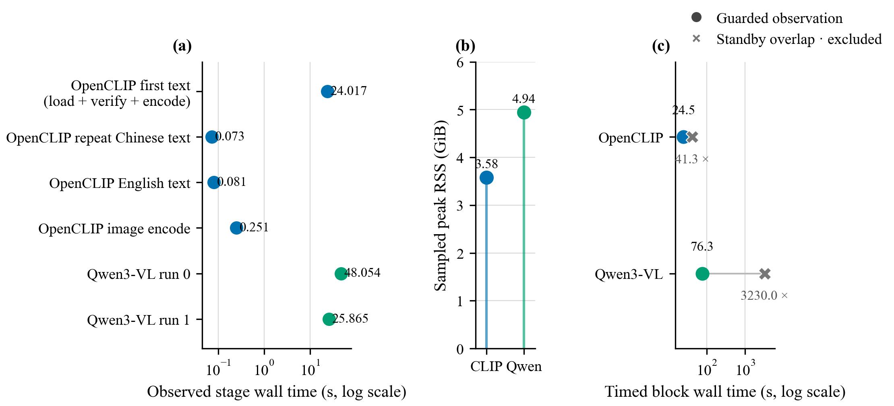

# 冻结学习模型真实推理与计时完整性报告（2026-08-29）

## 结论先行

Norma 的默认多模态主链已不再只是规则算法：固定权重的 multilingual
OpenCLIP 在 CPU 上真实完成 512D 中英文文本与图片编码，本地
Qwen3-VL-2B-Instruct 真实完成图片条件生成，并通过严格的
claims/citations/provenance 边界生成服务器规范答案。Clean 单机观察中，
OpenCLIP 首次文本调用（模型加载、两次全量 manifest 校验和编码）为
24.017 s，同进程重复中文编码为 0.073 s、图片编码为 0.251 s，采样峰值
RSS 为 3.582 GiB；Qwen3-VL 两次生成分别为 48.054 s 和 25.865 s，采样峰值
RSS 为 4.944 GiB。早期两次 Windows Modern Standby 重叠结果被完整保留，
但在 artifact 内标记为 `timing_valid=false` 并排除时延主张；守护后重跑只
证明计时窗口干净，**不能**把前后 wall-time 差异解释为模型加速。该实验是
真实 functional/contract smoke，不是检索准确率、生成质量、语义蕴含或
跨机器性能实验。



## 1. 问题与修复

首轮真实 Qwen v5 功能测试虽然生成结果、引用和 provenance 均通过，但
第二次生成的 wall time 达到 3,167.421 s。Windows System log 随后证明
进程在计时窗口内进入 Modern Standby：Event 506 到 Event 507 的区间为
3,196.113 s。OpenCLIP 的旧计时也与一次较短的 Modern Standby 区间重叠，
因此二者都不能作为干净性能证据。Qwen 历史 artifact 没有单独冻结“实际
sleep”字段，所以这里不从外部事件日志转述更细的 sleep-residency 数字。

修复是在两个 benchmark 的**计时作用域**外加 Windows
`SetThreadExecutionState(ES_CONTINUOUS | ES_SYSTEM_REQUIRED)` 守护，并在
`finally` 中恢复 `ES_CONTINUOUS`。它只抑制空闲系统休眠，不改变模型、图片、
query、token budget、generation 参数或 provider fingerprint；显式合盖、
电源键等仍可能使机器休眠。历史 artifact 不删除，以便审计失败过程。

| 模型 | Standby 重叠历史 timed block | Guard 后 clean timed block | 如何解释 |
|---|---:|---:|---|
| OpenCLIP | 41.282 s（排除） | 24.471 s | 向量完全一致；40.72% wall-time 差不能归因于 guard 或算法 |
| Qwen3-VL | 3,229.987 s（排除） | 76.311 s | 97.64% wall-time 差主要是移除休眠污染，不是模型 speedup |

## 2. 实验环境与计时口径

- CPU：Intel Core Ultra 7 255HX，20 cores / 20 logical processors。
- 内存：33,751,425,024 bytes（31.43 GiB 物理内存）。
- 系统：Windows 11 Home Chinese Edition，build 26200。
- 推理：CPU；两份 artifact 均记录 Torch threads=8 和
  `windows-mkl-sequential-torch-openmp-v1` 数值线程契约。
- OpenCLIP 的“首次文本”包含 provider 首次加载、完整资产校验和
  编码，不是 cold-disk 或 CLI 端到端时延。
- Qwen run 0 不包含 Python/Torch import，且 4.25 GB 权重的启动前 SHA 检查
  已在计时前完成；它也不是 cold-disk 或 CLI 端到端时延。
- RSS 是每 50 ms 轮询得到的 sampled peak，不保证捕获瞬时绝对峰值。
- OpenCLIP 每阶段只有 1 个点；Qwen 只有同进程 2 次生成。无置信区间、无
  显著性检验，数字只能称为这台机器上的原始观察。

## 3. Clean 原始结果

| 模型 | 观察 | 时间 | 采样峰值 RSS |
|---|---|---:|---:|
| OpenCLIP | provider constructor | 0.043738 s | — |
| OpenCLIP | 首次中文 text（load + verify + encode） | 24.017064 s | 3.582115 GiB |
| OpenCLIP | 同中文 repeat | 0.073374 s | — |
| OpenCLIP | English text | 0.080832 s | — |
| OpenCLIP | image encode | 0.250636 s | — |
| Qwen3-VL | provider initialization | 2.391291 s | — |
| Qwen3-VL | grounded generation run 0 | 48.053714 s | 4.944027 GiB |
| Qwen3-VL | grounded generation run 1 | 25.865119 s | — |

## 4. 学习模型与完整性证据

### 4.1 OpenCLIP

- 模型是冻结的 multilingual OpenCLIP，不是 16D 手工 fallback。
- 中文、中文 repeat、英文和图片均输出有限、L2-normalized 512D 向量。
- 中文 repeat 的 float32 SHA-256 逐字节相同；`repeat_cosine` 略大于 1 的
  `1.000000119` 是 float32 舍入，不是异常相似度结论。
- Standby 历史与 clean 重跑的 provider fingerprint、公开图片 SHA 和四个
  float32 向量 SHA 全部相同，证明 power guard 没有改变功能载荷。

### 4.2 Qwen3-VL grounded generation

- 两次同进程运行得到完全相同的 canonical answer、claim 和 citation。
- 所有 claim 只引用 allow-list 内的 `public-smoke-001`；query、candidate、
  evidence 三个 provenance digest 均通过重算。
- 模型只能返回 claims/citations，最终 answer/provenance 由服务器构造。
- `deterministic_replay=true` 只说明本次同进程的规范输出相同，不承诺 raw
  token 文本、跨进程、跨 CPU 或跨 OS 的位级确定性。
- Citation integrity 证明引用对象存在且 provenance 未漂移；它**不证明**
  claim 被像素语义蕴含。当前没有 semantic entailment verifier。

## 5. 冻结证据链

| Artifact | SHA-256 |
|---|---|
| OpenCLIP clean | `9ed9caaf33f23cf2996e51a2a2e58ad57e521f8620f8f57746a5c7b9b550cad2` |
| OpenCLIP standby historical | `178295b487ffd1737df7fc87b6e3ed631620b3a0ffee03112ba19d61c5df0080` |
| Qwen3-VL clean | `2651112ba55c6d0beb1d94d87d3788f34559ab31c23716ad81ace7cee4d488ca` |
| Qwen3-VL standby historical | `7a4549c287d03dfc9ab7930a5aa79015d8a82a9415dcaa7b4fcb5c52a226515b` |
| Fig.5 PNG | `2922e7617b185d80ae054701f05b4caeb3248bea304e6930d7b05c5d841c155a` |
| Fig.5 PDF | `fb05a74011efba660f36b618fa3ded8bcae727aeb25419efca859fcd58d66621` |
| Derived summary JSON | `880911e993175bd0c1ce35f2a59e600c5443a0343901f13c5b466249e140e922` |
| System profile JSON | `c5e9821f3b41fc9a0e8d372ab276681e9017cae8e702e16f87bafd0cbe89132d` |

两份 historical artifact 都包含 `timing_valid=false`、
`excluded_from_latency_claims=true`、Windows event evidence，以及指向对应
clean replacement 的路径和 SHA；自动汇总不应再把污染时延当性能结果。

## 6. 复现

```powershell
python -m pip install -e ".[dev,selection,multimodal]"
python scripts/install_qwen3vl_model.py
python scripts/download_public_smoke_image.py
python figures/benchmark_openclip_pinned_identity_smoke.py
python figures/benchmark_qwen3vl_grounded_smoke.py `
  --model-path .norma/data/models/qwen3-vl/Qwen3-VL-2B-Instruct-modelscope `
  --image .norma/public-smoke/gothic-architecture-banner.jpg `
  --output figures/qwen3vl_grounded_smoke_20260829.json `
  --max-new-tokens 256 `
  --repeats 2
python figures/gen_fig5_model_backed_runtime_integrity.py
```

生成器在读取数据前校验四份冻结 artifact 的 SHA-256、历史→clean crosslink、
functional payload 一致性与 exclusion 状态；任一漂移都会 fail closed。连续运行
两次时 PNG、PDF、summary JSON、LaTeX table/include 均逐字节一致。

## 一段话总结

这次优化不是把一次“3,167 秒”的异常结果删掉，而是先用 Windows 事件日志
定位到 Modern Standby 污染，再把原失败保留为不可用于 latency claim 的历史
证据，给 benchmark 加不改变模型输入的 idle-sleep guard，最后用同一公开图片、
相同模型指纹和相同功能载荷重跑；结果证明 OpenCLIP 的真实 512D 编码与本地
Qwen3-VL 的 grounded claims/citations 链都能在 CPU 上工作，并给出 24.017 秒
首次 OpenCLIP 文本调用、48.054/25.865 秒两次 Qwen 生成和 3.582/4.944 GiB
采样峰值 RSS，但这些数字仍严格限定为单机 functional smoke，而不是模型质量、
通用性能、语义蕴含或跨机器可复现性结论。
