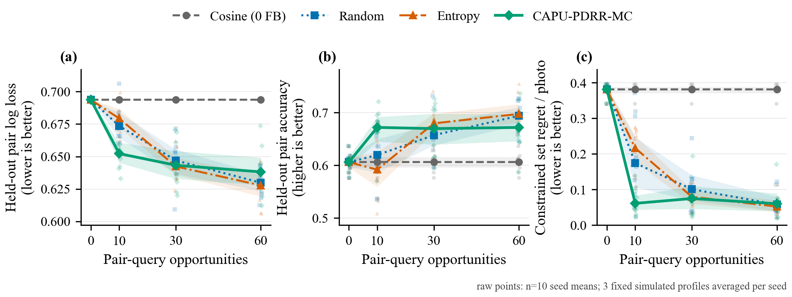

# CAPU-PDRR-MC 受控采集实验报告（2026-08-29）

## 结论先行

在这组固定的半合成偏好实验中，生产版 CAPU-PDRR-MC 的价值主要体现在**低反馈预算的样本效率**，而不是 60 次反馈后的普遍最优：预算为 10 时，PDRR 相对 random 与 predictive entropy 的 held-out pair loss、pair accuracy、constrained set regret/photo 三项配对 seed-bootstrap 区间都位于有利方向；预算到 30 和 60 时，PDRR 与两种采集基线的所有对应区间都跨过 0，不能建立可靠差异。60 次时 PDRR 的点估计略逊于 entropy/random，但区间不能证明它更差。PDRR 相对零反馈 cosine 在 60 次时三项指标仍全部改善且配对区间不跨 0。这里的“支持”只针对本实验的固定模拟器、公开图片和文件级拆分，不代表真实用户、总体人群或任意相册上的普遍结论。

## 1. 研究问题

本实验回答一个窄而可复核的问题：在相同的 67D Bayesian contextual preference learner、相同反馈噪声和相同 exact-K 选择约束下，生产 `ai.preferences.acquisition.suggest_pair` 实现的 CAPU-PDRR-MC，是否比 uniform random unseen-pair 和 predictive entropy 更有效地使用有限的 pair-query 预算。

本实验不测试 DPO、SFT、LoRA 或端到端多模态模型微调。OpenCLIP 编码器冻结，学习对象是其上的 67D Bayesian residual utility adapter。

## 2. 锁定协议

- 数据：70 张 Wikimedia Commons 公开图片，代理类别为 travel architecture、city night photography、mountain travel landscape。
- 数据源：只读 `contextual_preference_controlled_20260828.json`；LF 规范化后的可移植版本 SHA-256 为 `16bfdde5c61fc6dca02d19676a441fd37b265effb9bd0631dc4947ad5bb2cdbc`。
- 查询：`精选旅行摄影作品集`。
- 编码器：`openclip-xlm-roberta-base-vit-b-32-laion5b-raw-v2`。
- 特征：`capu-contextual-openclip512-67d-v1`；projection ID 为 `openclip512-structured-signed-hadamard-r32-rows37x-plus11-signmix-v1`。
- 拆分：10 个固定 seed；每个 seed 42 张 train、28 张 test；只保证 exact-filename-disjoint。
- 用户模拟器：3 个固定 category-bonus profile；latent utility 为 OpenCLIP query cosine 加显式 category bonus。
- 反馈：`sigmoid((u_left-u_right)/0.55)`，再用 seed/profile/unordered-pair 的 SHA-256 固定 Bernoulli draw；不同方法选到同一 unordered pair 时共享同一 outcome。
- 预算：0、10、30、60 个 pair-query opportunities。
- 决策约束：exact-K=6；每个代理类别最多 3 张。
- PDRR：生产 `suggest_pair`；B=64，shortlist=16，MC posterior integration + 每个假设 outcome 的 exact partition-constrained action re-solve；不是精确 Bayesian PDRR，也不是 exhaustive pair search。
- 数值策略：若 B=64 抛出 `AcquisitionNumericalError`，用相同 acquisition seed 重试一次 B=128；再次失败则明确 abstain，消耗一次 query opportunity，不生成伪反馈。
- 统计单位：先在每个 seed 内平均 3 个固定 profiles，再对 10 个 seed means 做 10,000 次非参数配对 percentile bootstrap。

### 防泄漏边界

PDRR helper 的输入仅包含当前 posterior、42 个 train candidates、已使用的 train pairs、exact-K/cap、B/shortlist 和 acquisition seed。28 张 test 图片与 simulator latent utility 不进入采集函数；latent utility 只在采集函数返回 pair 后用于产生该 pair 的模拟反馈，并在最终 held-out evaluation 时使用。

## 3. 数据与实现完整性审计

| 审计项 | 结果 |
|---|---:|
| 当前公开图片文件数 | 70 |
| 70/70 图片 SHA-256 与源 JSON 一致 | 是 |
| `ATTRIBUTION.json` SHA-256 一致 | 是 |
| 源 JSON 读取前后 SHA-256 不变 | 是 |
| 重算 67D feature 最大绝对误差 | 0.0 |
| 重算 query cosine 最大绝对误差 | 5.55e-17 |
| 完整 method × profile × seed runs | 120 |
| PDRR 每个 seed 的 acquisition candidates | 42 train / 0 test |
| 正式结果 JSON SHA-256 | `41aae2883c9f2381b9254e79da3bde61666b4250a25453f0e831b89bdd719f78` |
| 必要 pilot JSON SHA-256 | `e0915a469cbd14525754c292f975a240b1fdbba1be7b9c28d3b9806e7e0b92e0` |
| 当前可移植实验脚本 SHA-256 | `12773a0d63b3397138c3e907264ea2cce41f1d09abc12899e15021d20c2a3a92` |
| 生产 acquisition 实现 SHA-256 | `decd6ee792d337fba0ff7d30f7917b52dc06044f60e26f9448efe9f1495db2d4` |
| 生产 contextual learner SHA-256 | `1e2420b44e1988052864108c158408ae38276c2a0a81e59387d50f8be7063a73` |

公开 JSON 的 `path_base` 固定为仓库根，所有文件位置采用 POSIX 仓库相对路径；loader 会在本次 clone 的仓库根下安全解析并拒绝绝对路径、盘符、反斜杠和 `..` 逃逸。源 JSON、pilot、full、日志与生成的 TeX 均采用 UTF-8（无 BOM）、LF 和末尾换行；写入器显式指定 `newline="\n"`，仓库 `.gitattributes` 固定文本 checkout 为 LF。源 JSON 期望 album 为 `.norma/demo-album-eval`，`ATTRIBUTION.json` SHA-256 为 `ad06ababdf5fb9f1827d38736a26186e832bbbc2653c6dc5c99c95cc598e03ac`；70 张实验图片另逐文件固定 SHA-256，而不是依赖本机目录绝对路径。

Figure 4 生成器同时固定 `SOURCE_DATE_EPOCH=0`；连续生成两次时 PDF、PNG、结果表与 LaTeX include 的 SHA-256 全部逐字节一致。当前 PNG/PDF SHA-256 分别为 `50487ba7d463730aafc5d44ae29994a128bb0844863728967c41438a3bbf5601` 与 `a9f18754c246a9765bd3c6a45717be288729314896a0c0239f24e393dbab41f4`。

### 3.1 acquisition 代码漂移后的锁定复跑

旧正式结果记录的 production acquisition SHA-256 为 `54030cc5f96faeccf5835c8a253dea1cb291a557d3c47176bd446b8dab66732f`，但复核时工作树中的实现已是 `decd6ee792d337fba0ff7d30f7917b52dc06044f60e26f9448efe9f1495db2d4`。因此旧结果不能继续被描述为“当前生产代码的可复现结果”。旧 pilot/full、日志、报告和 Fig4 已按原始字节封存为 superseded historical artifacts；公开的小型 before 图为 [`fig4_pdrr_acquisition_learning_historical_acquisition_54030c.png`](fig4_pdrr_acquisition_learning_historical_acquisition_54030c.png)。随后用当前代码、相同 70 张图片、相同拆分、`workers=1` 和相同 10,000 次 bootstrap 从头重跑 pilot 与 full。

| 对照项 | 历史结果（54030c） | 当前锁定复跑（decd6e） | 差异 |
|---|---:|---:|---:|
| full raw JSON SHA-256 | `043aa5ce…` | `41aae288…` | provenance、LF 与运行时间改变 |
| pilot raw JSON SHA-256 | `57b78066…` | `e0915a46…` | provenance、LF、运行时间与新增 paired-budget schema |
| 4 methods × 4 budgets × 3 metrics 均值 | 全部历史值 | 全部当前值 | 最大绝对差 `0.0` |
| full paired-budget comparisons | 历史值 | 当前值 | JSON 逐项相等 |
| 120 runs 的全部 checkpoints | 历史值 | 当前值 | JSON 逐项相等 |
| 全部反馈 pair 与 Bernoulli choice | 历史值 | 当前值 | JSON 逐项相等 |
| PDRR opportunities / feedback | 1,800 / 1,800 | 1,800 / 1,800 | 0 |
| retry / abstain / fallback | 0 / 0 / 0 | 0 / 0 / 0 | 0 |
| PDRR selection 总时间 | 72.1553 s | 58.1968 s | -13.9585 s（仅描述性） |
| full wall time | 84.2847 s | 67.8845 s | -16.4002 s（仅描述性） |

去除 provenance 和所有 wall/selection/training timing 字段后，历史与当前 full 的 canonical scientific payload 逐项相等，二者 SHA-256 均为 `3fe8127dc577dde11cb7e007b7ab904d461d53e5a115d9b0aaa2d1986b1e7db9`。当前 Fig4 的 PNG/PDF 也与 historical before 图逐字节相同。运行时间没有独立重复、机器负载控制或计时预注册，因此不能把这次 wall-time 下降解释为算法加速；可支持的结论仅是 acquisition 代码漂移没有改变本锁定协议下的选择、反馈或科学指标。

## 4. 原始均值曲线

下表是 10 个 seed means 的均值；每个 seed mean 已先平均 3 个固定 profiles。完整 raw seed means、95% bootstrap intervals、posterior checkpoints 和逐步 feedback trace 均保存在正式 JSON 中。

| Method | Budget | Pair loss ↓ | Pair accuracy ↑ | Set regret/photo ↓ |
|---|---:|---:|---:|---:|
| Cosine, zero feedback | 0 | 0.693718 | 0.606085 | 0.380869 |
| Random contextual | 0 | 0.693718 | 0.606085 | 0.380869 |
| Entropy contextual | 0 | 0.693718 | 0.606085 | 0.380869 |
| CAPU-PDRR-MC | 0 | 0.693718 | 0.606085 | 0.380869 |
| Cosine, zero feedback | 10 | 0.693718 | 0.606085 | 0.380869 |
| Random contextual | 10 | 0.673574 | 0.619577 | 0.174244 |
| Entropy contextual | 10 | 0.679371 | 0.591799 | 0.216221 |
| CAPU-PDRR-MC | 10 | **0.652246** | **0.671958** | **0.061101** |
| Cosine, zero feedback | 30 | 0.693718 | 0.606085 | 0.380869 |
| Random contextual | 30 | 0.646978 | 0.657231 | 0.100708 |
| Entropy contextual | 30 | **0.642360** | **0.679630** | 0.079414 |
| CAPU-PDRR-MC | 30 | 0.643297 | 0.669665 | **0.074693** |
| Cosine, zero feedback | 60 | 0.693718 | 0.606085 | 0.380869 |
| Random contextual | 60 | 0.629845 | 0.693915 | 0.057889 |
| Entropy contextual | 60 | **0.627782** | **0.697531** | **0.052210** |
| CAPU-PDRR-MC | 60 | 0.638159 | 0.671869 | 0.060091 |

粗体仅标出每个非零预算下学习方法中的最佳点估计，不表示相对方法的区间一定排除 0。

## 5. 配对 seed bootstrap

下表定义“正数 = PDRR 更好”；loss 与 regret 使用 baseline minus PDRR，accuracy 使用 PDRR minus baseline 并以 percentage points 表示。

| Budget | Comparison | Δ pair loss | Δ accuracy (pp) | Δ regret/photo |
|---:|---|---:|---:|---:|
| 10 | PDRR vs random | **+0.0213 [0.0107, 0.0324]** | **+5.24 [1.70, 8.83]** | **+0.1131 [0.0436, 0.1888]** |
| 10 | PDRR vs entropy | **+0.0271 [0.0160, 0.0374]** | **+8.02 [3.39, 12.55]** | **+0.1551 [0.1176, 0.1931]** |
| 30 | PDRR vs random | +0.0037 [-0.0098, 0.0168] | +1.24 [-1.95, 4.29] | +0.0260 [-0.0169, 0.0708] |
| 30 | PDRR vs entropy | -0.0009 [-0.0111, 0.0088] | -1.00 [-4.30, 2.29] | +0.0047 [-0.0297, 0.0389] |
| 60 | PDRR vs random | -0.0083 [-0.0191, 0.0021] | -2.20 [-4.59, 0.34] | -0.0022 [-0.0222, 0.0200] |
| 60 | PDRR vs entropy | -0.0104 [-0.0205, 0.0011] | -2.57 [-4.91, 0.18] | -0.0079 [-0.0418, 0.0232] |

预算 10 时，PDRR 相对 random 的 loss 相对降低 3.17%、accuracy 提高 5.24 pp、regret/photo 相对降低 64.93%；相对 entropy 分别为 3.99%、8.02 pp 和 71.74%。预算 30 与 60 的所有对应区间都跨 0。由于“低预算优势”是在完整曲线生成后重点分析的，它应视为探索性结果；需要独立预注册复现实验才能升级为确认性结论。

## 6. PDRR 数值诊断与开销

| 项目 | 结果 |
|---|---:|
| PDRR query opportunities | 1,800 |
| 成功得到并记录反馈 | 1,800 |
| B=128 retry | 0 |
| B=128 后 abstain | 0 |
| 可观测的 all-pair VOI invariant errors | 0 |
| selected-pair VOI invariant violations | 0 |
| Laplace fallback outcomes | 0 / 3,600 |
| ESS minimum / median / p95 | 37.67 / 55.29 / 60.05 |
| raw PDRR estimate min / mean / max | 0.000 / 0.187 / 2.113 |
| PDRR selection mean / p95 / max | 32.33 / 42.59 / 102.15 ms |
| PDRR selection total | 58.20 s |
| Entropy selection total | 3.97 s |
| 完整单进程实验 wall time | 67.88 s |

PDRR 的 acquisition selection 总开销约为 entropy 的 14.7 倍，但本次单步均值约 32 ms，仍处于交互式后端可接受范围。ESS 始终高于 fallback threshold 16，因此这个数据集只证明正常重要性加权路径稳定，**没有**实证覆盖低 ESS Laplace fallback 分支。

pilot 使用 1 seed × 1 profile × 10 opportunities：10/10 成功、0 retry、0 abstain，PDRR selection 共 0.754 s；按 pilot 单步线性外推正式 1,800 次 selection 为 135.69 s，而正式值为 58.20 s，外推高估约 133.2%。早期机会的 eligible pool 更大，且单次短 pilot 对本机负载敏感，因此它只用于确认可运行性与数量级，不作为性能估计。即便采用保守外推也未触发“大于 20 分钟则按 seed 多进程并行”的条件，正式实验采用单进程以减少运行环境差异。

## 7. 发现、解释、影响与下一步

### 发现 1：PDRR 的优势集中在预算 10

- 观察：预算 10 时，PDRR 对 random 与 entropy 的三项配对区间全部位于有利方向。
- 解释：PDRR 的 acquisition objective 直接估计 constrained action regret reduction，能够优先询问会改变 exact-K/cap 决策的 pair；entropy 只追求预测不确定性，random 不使用后验。
- 影响：对真实产品中“不想让用户比较很多次”的冷启动阶段，PDRR 有明确的候选价值。
- 下一步：预注册预算 10 为主要 endpoint，在新的公开图集、更多 profile 和真实人类反馈上复现。

### 发现 2：优势未延续到预算 30/60

- 观察：预算 30/60 时，PDRR 与 random/entropy 的所有配对区间都跨 0；60 次点估计略差。
- 解释：一种合理但尚未证实的原因是 PDRR 优化 42 张 train pool 上的当前 constrained action，而评估使用 28 张 held-out 图片；随着预算增加，entropy/random 对全局 pair order 的覆盖可能追上，而 train-pool decision-aware acquisition 未必继续改善 held-out generalization。噪声反馈也会造成非单调 regret 曲线。
- 影响：不能把结果包装成“PDRR 全程优于 entropy”。更准确的项目表述是“PDRR 提高低预算 query efficiency，后期与基线不可区分”。
- 下一步：同时预注册 in-pool realized decision regret 与 held-out generalization 两类 endpoint；做 B、shortlist、constraint-awareness、MC seed 数量的消融。

### 发现 3：数值路径稳定，但 fallback 尚未被压力测试

- 观察：1,800/1,800 suggestions 成功，最小 ESS 37.67，0 retry、0 abstain、0 fallback、0 可观测 VOI 错误。
- 解释：本实验后验与候选 pair 没有产生严重 importance-weight degeneracy。
- 影响：可证明正常路径稳定，不能证明极端 posterior 或高度分离 pair 下的 fallback 可靠。
- 下一步：构造低 ESS adversarial fixture，并在真实 album 上统计 B128/fallback/abstain rate。

### 发现 4：低预算收益以额外计算为代价

- 观察：PDRR selection 总开销约为 entropy 的 14.7 倍，但本次均值约 32 ms/op。
- 解释：每个 shortlisted pair 都需要两个 hypothetical outcomes 的 MC regret evaluation 与 exact constrained re-solve。
- 影响：当前规模可以在线运行；相册规模继续增长时，需要候选预筛、向量化或异步预取。
- 下一步：测量候选数 42/100/500/1000 的延迟曲线，并将 shortlist recall 与最终 pair quality 一起报告。

## 8. 生成过程问题记录

### 问题 A：LaTeX caption 生成器出现 tuple 类型错误

- 发现：第一次运行 Figure 4 生成器时，PNG/PDF 与 table 已生成，但 LaTeX include 阶段以 `TypeError: expected str instance, tuple found` 退出。
- 原因：多行 caption 字符串末尾保留了逗号，使括号表达式成为单元素 tuple。
- 解决：移除两个 caption 表达式末尾逗号，并重新执行 Ruff、py_compile 和完整生成器。
- 量化前后：修复前 exit code=1、4 个目标 artifacts 中 3 个存在；修复后 exit code=0、4/4 artifacts 均存在且非空。
- 影响：只影响文档 artifact 的完整生成，不影响实验 JSON、统计或图中数值。

### 问题 B：首版结果只固化了 budget 60 的配对比较

- 发现：完整学习曲线显示 budget 10 可能是 PDRR 的主要价值点，但首版 JSON 只保存 final-budget paired comparisons。
- 原因：分析 schema 沿用了 Figure 3 的“只比较最终预算”结构，无法审计低预算差异。
- 解决：新增 `paired_budget_comparisons`，固定保存 budget 10/30/60 的全部配对比较；随后从头重跑 120 个 runs，使最终 benchmark script SHA 与结果 provenance 一致。
- 量化前后：首版固化 1 个预算 × 4 个 comparisons × 3 metrics；修复后固化 3 个预算 × 4 个 comparisons × 3 metrics。核心均值没有变化。
- 研究边界：budget 10 的重点解释是在看到曲线后形成，因此标记为探索性，而不是事后伪装为预注册结论。

## 9. 局限性

1. 偏好来自 3 个显式 category-bonus 模拟器，不是真人。
2. 类别来自 Wikimedia 搜索词，可能包含标签噪声、摄影师或来源偏差。
3. train/test 仅按 exact filename 隔离，未按场景、摄影师或语义近重复去重。
4. 10 个 splits 相互重叠，不能当作 10 个 iid 用户或独立数据集。
5. PDRR 是 B=64 的 MC 估计并使用 shortlist=16；exact 仅指 constrained action re-solve。
6. 冻结 OpenCLIP 可能在预训练时见过公开图片。
7. paired bootstrap 区间是对固定 seeds 的敏感性描述，不等同于总体人群上的确认性显著性。
8. 本实验没有评价 DPO、RAG、VLM generation 或端到端多模态微调。
9. 模拟反馈使用 temperature=0.55，而生产 learner/acquisition 使用其固定 logistic link；四种方法共享这项 calibration misspecification，但结果不能解释为已知真实生成模型下的 Bayes-optimality 证明。

## 一段话总结

在 70 张公开 Wikimedia 图片、10 个固定 42/28 文件级拆分、3 个模拟偏好 profile 和相同 67D Bayesian learner 下，生产 CAPU-PDRR-MC（B=64、shortlist=16、MC posterior integration + exact constrained re-solve）在仅 10 次 pair-query 时相对 random 与 predictive entropy 的 held-out loss、order accuracy 和 constrained set regret/photo 均取得配对区间不跨 0 的优势，其中 regret/photo 相对降低约 64.9% 和 71.7%；但到 30/60 次时差异全部跨 0，60 次点估计还略逊，因此合理结论是“PDRR 改善低预算样本效率，但未证明最终或普遍优越”。用当前 acquisition SHA 从头复跑后，所有 full 科学指标、checkpoints 与反馈选择对旧结果的差异均为 0；1,800/1,800 次生产采集成功、0 retry/abstain/fallback/可观测 VOI 错误，本次均值约 32 ms/op，说明正常数值路径稳定且可在线使用。证据仍是探索性的半合成结果，下一步必须用预注册的新图集与真人偏好复现，并补充低 ESS 压力测试和 B/shortlist/constraint-awareness 消融。
