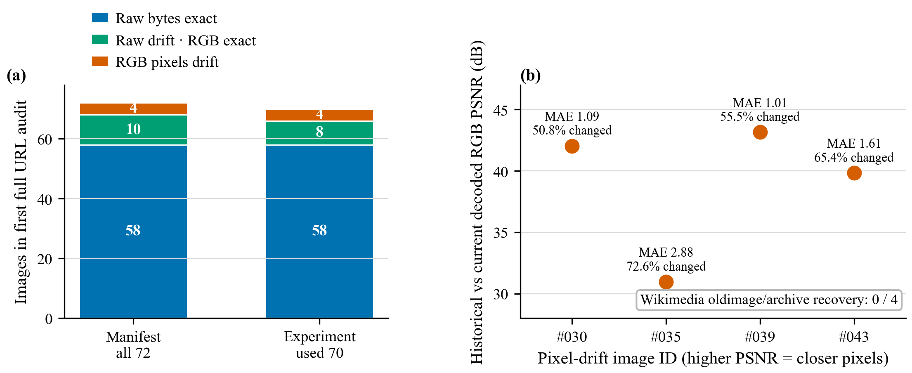

# Wikimedia 实验输入漂移审计（2026-08-29）

## 结论先行

原先把固定的 Wikimedia thumbnail URL 称为“可重建实验 fixture”是不严谨的。
本地历史副本 72/72 都仍与实验 manifest 的 raw SHA-256 完全一致，但在
2026-08-29 顺序重新请求相同 72 个 URL 时，只有 58/72（80.56%）返回历史
bytes；10/72（13.89%）只改变了 52 bytes EXIF、解码 RGB 完全一致；另有
4/72（5.56%）连解码像素也变化。实验实际使用的 70 张中，当前 URL 只能恢复
66/70（94.29%）的历史像素。Wikimedia `oldimage/archive` 对 14 个 raw-drift
文件的恢复结果是 0/14，四个 pixel-drift 文件也为 0/4。因此旧实验继续以
历史 raw SHA 为不可变 provenance，不追溯性改写；下载器保持 fail closed，
README/manifest 改为“历史内容针与校验器”。要做到真正 fresh-clone exact
replay，仍需发布带逐图 attribution 的 licensed content-addressed archive，
或用新数据契约和新 experiment ID 重跑。

## 1. 发现的问题

`scripts/download_contextual_preference_fixture.py` 固定了 72 个 Wikimedia
thumbnail URL、历史 byte size 和 SHA-256。这个设计可以发现漂移，却不能让
一个 mutable CDN URL 永久返回旧内容。首个 fresh-output 尝试就在文件 #001
失败：历史 781,041 bytes，当前 780,989 bytes；进一步检查发现两者解码 RGB
完全相同，说明最初只是 metadata drift。完整审计后又发现四张真正的像素
漂移，因此仅添加 pixel SHA 也不能完整恢复旧实验。

## 2. 审计协议

- 本地基线：72 张历史文件，总计 40,446,246 bytes；逐文件 raw size/SHA
  72/72 与 manifest 一致。
- 网络：固定 manifest URL，单线程顺序请求，0.35 s 节流，最多 3 次重试；
  72/72 下载成功，0 解码失败。
- 解码：Pillow 11.1.0，`Image.open → ImageOps.exif_transpose → RGB →
  contiguous image.tobytes()`。
- 比较：raw size/SHA、解码宽高、RGB SHA；对四个 pixel-drift 文件再计算
  MAE、RMSE、PSNR、最大通道绝对误差和变化通道比例。
- Archive：对 14 个 raw-drift 文件执行完整 `imageinfo` revision 查询，并对
  唯一可用的 #035 old thumbnail 候选连续请求两次。

该审计只描述 2026-08-29 的上游响应，不保证未来可用性或内容。

证据边界：公开 artifact 冻结了历史 manifest/本地历史文件、四个 current
hash/指标摘要和聚合结论，但没有冻结 72 个 current response binaries、10 个
metadata-only current raw hash 或完整的 oldimage per-file response transcript。
因此历史侧 size/raw SHA/pixel SHA、计数闭合以及由记录 RMSE 推回的 PSNR 可以
离线独立复算；current 两端差分、metadata-only RGB 等价和 archive 0/14 则应
表述为“本次审计 JSON 记录的观测”，不能称为完全可离线独立重放的证据。

## 3. 量化结果

| 范围 | Raw exact | Raw drift / RGB exact | RGB drift | 可恢复历史 RGB |
|---|---:|---:|---:|---:|
| Manifest 72 | 58（80.56%） | 10（13.89%） | 4（5.56%） | 68/72（94.44%） |
| 实验使用 70 | 58（82.86%） | 8（11.43%） | 4（5.71%） | 66/70（94.29%） |

10 个 metadata-only 文件当前均比历史文件少 52 bytes，EXIF 也恰好少
52 bytes；JPEG quantization tables 与解码 RGB 10/10 相同。它们可以被称为
“当前模型输入等价”，但不能称为 raw-byte exact，也不能保证 URL 将来继续
返回同一像素。

四个像素漂移文件：

| ID | 历史→当前 bytes | MAE | RMSE | PSNR | Max abs | 变化通道 |
|---|---:|---:|---:|---:|---:|---:|
| #030 | 276,794→274,661 | 1.0873 | 2.0194 | 42.03 dB | 32 | 50.85% |
| #035 | 233,293→289,231 | 2.8805 | 7.2233 | 30.96 dB | 246 | 72.57% |
| #039 | 454,244→449,896 | 1.0069 | 1.7744 | 43.15 dB | 37 | 55.51% |
| #043 | 1,045,582→1,042,129 | 1.6079 | 2.5986 | 39.84 dB | 37 | 65.39% |

同一普通 URL 的重复观察也不是完全确定：#030/#039 为 8/8 漂移；#035/#043
各为 7/8 漂移、1/8 恰好返回历史版。因此“偶尔请求到旧缩略图”不能当成
可复现机制。

## 4. 根因定位：不是原图 revision 被替换

14 个 raw-drift 文件的当前 original SHA-1 前 12 位都仍匹配本地文件名中的
历史前缀；13/14 只有一个 original revision。唯一有两个 revision 的 #035，
其 current original 仍是实验使用的 `bd0b8e…`，old original 是更早的
`a9353d…`。官方 archived thumbnail 连续两次稳定返回 288,373 bytes，但其
raw SHA `d24b1906…eb82`、pixel SHA `91973fa9…bb2` 与历史实验的 raw
`e71ac275…3af6`、pixel `1ff80979…48dc` 都不一致。

因此证据指向 Wikimedia thumbnail renderer、metadata 或 CDN cache 版本变化，
不是 current original 被另一张原图替换。`oldimage` 只保存原图 revision，
不能恢复过去某次 thumbnail renderer 的精确输出。

## 5. 已采取的修复与未解决边界

已完成：

1. 保留 contextual/PDRR 旧实验的逐文件 historical raw SHA，不把新响应冒充
   旧输入，也不追溯性改写 experiment ID。
2. 下载器对任何 raw pin 漂移继续 fail closed；错误明确写成“upstream
   response no longer matches the historical content pin”。
3. Manifest claim boundary、README 与 THIRD_PARTY_NOTICES 不再承诺 mutable
   URL 能永久重建实验。
4. `--offline` 对现有历史 fixture 仍验证 72/72，attribution SHA 保持
   `ad06abab…03ac`。
5. 14/14 的 title/source/download/license 字段与 manifest 一致；Commons
   当前许可字段也匹配。图片本体继续不进入 Git 仓库。

尚未解决：fresh clone 无法只靠当前 Wikimedia URL exact replay 旧实验。正确
闭环是发布单独的、逐图遵守许可并带完整 attribution 的内容寻址数据归档，固定
archive SHA-256；如果选择 decoded-RGB 新契约，也必须补齐四张历史像素并以新
experiment ID 重跑。当前不把 58/72 或 68/72 误写成 72/72。

## 6. 冻结证据

| Artifact | SHA-256 |
|---|---|
| Drift audit JSON | `4557e0a45ee2dd4188ff83d23ba91e89a65781873bd2a64cf56123097425c9a3` |
| Fig.6 generator | `517a6691561f6a25430eb42180c919b3faae63f3f1bdeb3e1614d4d8b428d07f` |
| Fig.6 PNG | `9649371034afe07fe992d2e291579c1d30410c87d3152d088d38c253c26e3975` |
| Fig.6 PDF | `1e307909d5fdf83e099cf1c2431c8d227aef45ab09d1d97b67e425042a5c0b7d` |
| Historical manifest (post-clarification) | `991a0ebe0a2e66454ec7e85decd667a9bb2b81284278542f7cde5a64d3c72d12` |
| Fail-closed downloader | `88d179ab80491cfe2be4a02759e8c433bf77a5b06053795dd9fe38217f09fc4d` |
| Attribution JSON | `ad06ababdf5fb9f1827d38736a26186e832bbbc2653c6dc5c99c95cc598e03ac` |

## 一段话总结

这次问题的本质是把“固定 URL”误当成“固定内容”：审计从首张 52-byte EXIF
变化扩展到 72 张全量请求，最终量化出 58 张 raw exact、10 张 metadata-only、
4 张真实 RGB drift，并进一步证明 Wikimedia oldimage/archive 0/14 无法恢复
历史缩略图；修复没有篡改旧实验或用相似图片蒙混过关，而是保留 historical
raw SHA、让下载器 fail closed、把公开文档降级为诚实的历史内容针，并明确
fresh-clone exactness 仍需要带许可和 attribution 的内容寻址归档或新实验重跑。
