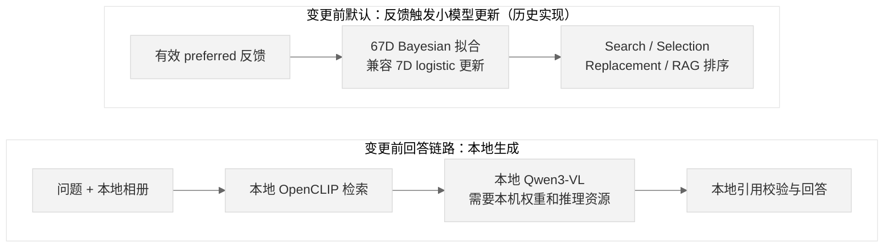

# Norma 方向调整前的默认链路

代码行为示意，不是模型性能实验或网页截图。历史模型与实验仍保留为显式可选模式。

```mermaid
%%{init: {"theme":"base","themeVariables":{"fontFamily":"Microsoft YaHei, Arial","fontSize":"16px","primaryColor":"#f3f3f3","primaryTextColor":"#303030","lineColor":"#666666"},"flowchart":{"curve":"linear","nodeSpacing":28,"rankSpacing":40}}}%%
flowchart TB
    subgraph feedback["变更前默认：反馈触发小模型更新（历史实现）"]
      direction LR
      choices["有效 preferred 反馈"] --> train["67D Bayesian 拟合<br/>兼容 7D logistic 更新"]
      train --> ranking["Search / Selection<br/>Replacement / RAG 排序"]
    end
    subgraph inference["变更前回答链路：本地生成"]
      direction LR
      query["问题 + 本地相册"] --> retrieve["本地 OpenCLIP 检索"]
      retrieve --> vlm["本地 Qwen3-VL<br/>需要本机权重和推理资源"]
      vlm --> answer["本地引用校验与回答"]
    end
    feedback ~~~ inference
```
