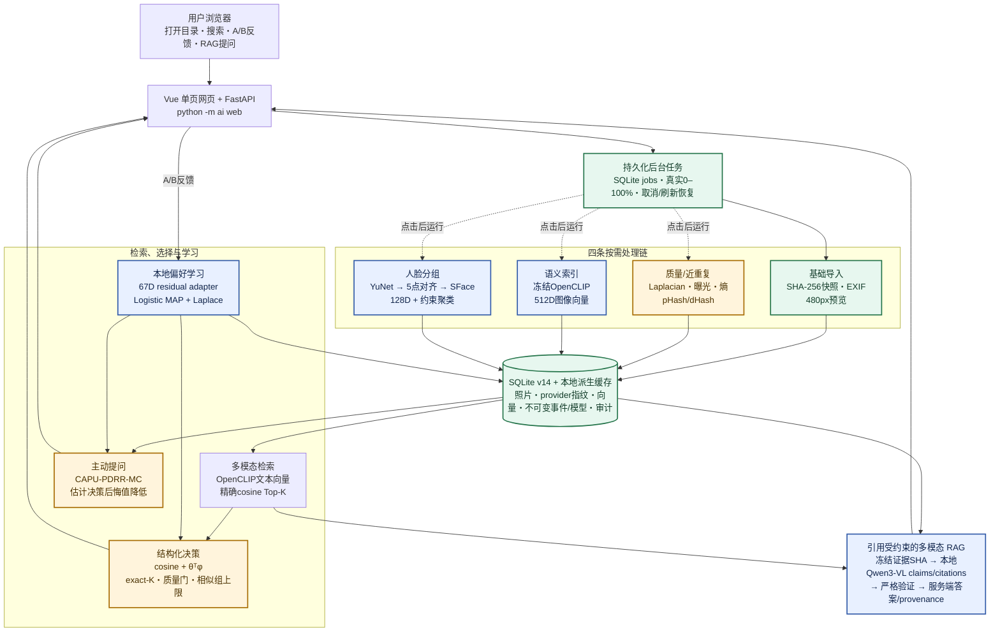

# Norma 多模态系统总览

```mermaid
flowchart TB
    USER["用户浏览器<br/>打开目录・搜索・A/B反馈・RAG提问"]
    WEB["Vue 单页网页 + FastAPI<br/>python -m ai web"]
    JOBS["持久化后台任务<br/>SQLite jobs・真实0–100%・取消/刷新恢复"]

    subgraph ANALYSIS["四条按需处理链"]
        direction LR
        IMPORT["基础导入<br/>SHA-256快照・EXIF<br/>480px预览"]
        QUALITY["质量/近重复<br/>Laplacian・曝光・熵<br/>pHash/dHash"]
        SEMANTIC["语义索引<br/>冻结OpenCLIP<br/>512D图像向量"]
        PEOPLE["人脸分组<br/>YuNet → 5点对齐 → SFace<br/>128D + 约束聚类"]
    end

    DATA[("SQLite v14 + 本地派生缓存<br/>照片・provider指纹・向量・不可变事件/模型・审计")]

    subgraph INTELLIGENCE["检索、选择与学习"]
        direction LR
        SEARCH["多模态检索<br/>OpenCLIP文本向量<br/>精确cosine Top-K"]
        PREF["本地偏好学习<br/>67D residual adapter<br/>Logistic MAP + Laplace"]
        SELECT["结构化决策<br/>cosine + θᵀφ<br/>exact-K・质量门・相似组上限"]
        ACTIVE["主动提问<br/>CAPU-PDRR-MC<br/>估计决策后悔值降低"]
    end

    RAG["引用受约束的多模态 RAG<br/>冻结证据SHA → 本地Qwen3-VL claims/citations<br/>→ 严格验证 → 服务端答案/provenance"]

    USER --> WEB
    WEB --> JOBS
    JOBS --> IMPORT
    JOBS -. "点击后运行" .-> QUALITY
    JOBS -. "点击后运行" .-> SEMANTIC
    JOBS -. "点击后运行" .-> PEOPLE
    IMPORT --> DATA
    QUALITY --> DATA
    SEMANTIC --> DATA
    PEOPLE --> DATA
    DATA --> SEARCH
    SEARCH --> SELECT
    PREF --> SELECT
    SELECT --> WEB
    WEB -->|"A/B反馈"| PREF
    PREF --> DATA
    DATA --> ACTIVE
    PREF --> ACTIVE
    ACTIVE --> WEB
    SEARCH --> RAG
    DATA --> RAG
    RAG --> WEB

    classDef learned fill:#e8f0ff,stroke:#315aa8,stroke-width:2px,color:#10244a;
    classDef traditional fill:#fff4dc,stroke:#a66a00,stroke-width:2px,color:#4a3100;
    classDef integrity fill:#e7f7ef,stroke:#24744a,stroke-width:2px,color:#123c29;
    class SEMANTIC,PEOPLE,PREF,RAG learned;
    class QUALITY,SELECT,ACTIVE traditional;
    class IMPORT,DATA,JOBS integrity;
```

图例：蓝色是冻结预训练模型或本地学习模型；黄色是传统算法与确定性优化；绿色是缓存、持久化和完整性边界。
