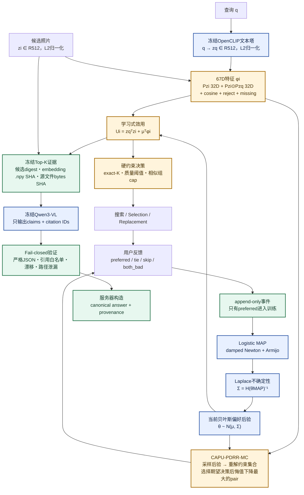

# Norma 偏好学习与 Grounded RAG 数据流

```mermaid
flowchart TB
    QUERY["查询 q"]
    TEXT["冻结OpenCLIP文本塔<br/>q → zq ∈ R512，L2归一化"]
    IMAGES["候选照片<br/>zi ∈ R512，L2归一化"]
    PHI["67D特征 φi<br/>Pzi 32D + Pzi⊙Pzq 32D<br/>+ cosine + reject + missing"]
    MODEL["当前贝叶斯偏好后验<br/>θ ~ N(μ, Σ)"]
    UTILITY["学习式效用<br/>Ui = zqᵀzi + μᵀφi"]
    HARD["硬约束决策<br/>exact-K・质量阈值・相似组cap"]
    RESULT["搜索 / Selection / Replacement"]

    FEEDBACK["用户反馈<br/>preferred / tie / skip / both_bad"]
    EVENT["append-only事件<br/>只有preferred进入训练"]
    TRAIN["Logistic MAP<br/>damped Newton + Armijo"]
    LAPLACE["Laplace不确定性<br/>Σ = H(θMAP)⁻¹"]
    PDRR["CAPU-PDRR-MC<br/>采样后验 → 重解约束集合<br/>选择期望决策后悔值下降最大的pair"]

    SNAP["冻结Top-K证据<br/>候选digest・embedding .npy SHA・源文件bytes SHA"]
    QWEN["冻结Qwen3-VL<br/>只输出claims + citation IDs"]
    CHECK["Fail-closed验证<br/>严格JSON・引用白名单・漂移・路径泄漏"]
    ANSWER["服务器构造<br/>canonical answer + provenance"]

    QUERY --> TEXT
    TEXT --> PHI
    IMAGES --> PHI
    PHI --> UTILITY
    MODEL --> UTILITY
    UTILITY --> HARD
    HARD --> RESULT
    RESULT --> FEEDBACK
    FEEDBACK --> EVENT
    EVENT --> TRAIN
    TRAIN --> LAPLACE
    LAPLACE --> MODEL
    PHI --> PDRR
    MODEL --> PDRR
    PDRR --> FEEDBACK

    UTILITY --> SNAP
    IMAGES --> SNAP
    SNAP --> QWEN
    QWEN --> CHECK
    CHECK --> ANSWER

    classDef model fill:#e8f0ff,stroke:#315aa8,stroke-width:2px,color:#10244a;
    classDef decision fill:#fff4dc,stroke:#a66a00,stroke-width:2px,color:#4a3100;
    classDef guard fill:#e7f7ef,stroke:#24744a,stroke-width:2px,color:#123c29;
    class TEXT,MODEL,TRAIN,LAPLACE,QWEN model;
    class PHI,UTILITY,HARD,PDRR decision;
    class EVENT,SNAP,CHECK,ANSWER guard;
```

关键边界：OpenCLIP 与 Qwen3-VL 都冻结；真正从本地反馈更新的是 67 维后验；RAG 验证引用与来源链，不验证 claim 的语义蕴含。
