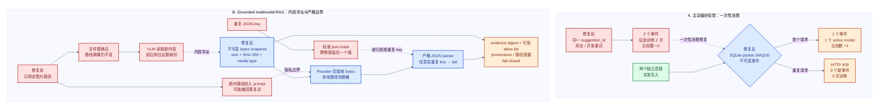

# Preference and RAG Integrity Fixes

主动偏好反馈一次性消费，以及 grounded multimodal RAG 图片证据内容寻址、路径脱敏和严格 JSON 解析的修复前后数据流。

```mermaid
%%{init: {"theme": "base", "themeVariables": {"background": "#ffffff", "fontFamily": "Arial, Microsoft YaHei, sans-serif", "fontSize": "19px", "primaryTextColor": "#111827", "lineColor": "#374151"}, "flowchart": {"curve": "linear", "htmlLabels": true, "nodeSpacing": 34, "rankSpacing": 52}}}%%
flowchart TB
    subgraph canvas[" "]
    direction TB
    subgraph preference["A. 主动偏好反馈：一次性消费"]
        direction LR
        pb_request["修复前<br/>同一 suggestion_id<br/>双击 / 并发重试"] --> pb_result["2 个事件<br/>后验训练 2 次<br/>比较数 +2"]
        pb_result -.->|"一次性消费修复"| pa_guard{"修复后<br/>SQLite partial UNIQUE<br/>不可变事件"}
        pa_request["两个独立连接<br/>并发写入"] --> pa_guard
        pa_guard -->|"首个请求"| pa_ok["1 个事件<br/>1 个 active model<br/>比较数 +1"]
        pa_guard -->|"重复请求"| pa_conflict["HTTP 409<br/>0 个新事件<br/>0 次训练"]
    end

    subgraph rag["B. Grounded multimodal RAG：内容寻址与严格边界"]
        direction LR
        rb_path["修复前<br/>只绑定图片路径"] --> rb_digest["文件替换后<br/>路径摘要仍不变"] --> rb_wrong["VLM 读取新内容<br/>却沿用旧证据身份"]
        rb_path --> rb_leak["绝对路径进入 prompt<br/>可能被回答复述"]
        rb_json["重复 JSON key"] --> rb_overwrite["标准 json.loads<br/>静默保留后一个值"]

        rb_wrong -.->|"内容寻址"| ra_snapshot["修复后<br/>不可变 bytes snapshot<br/>size + SHA-256 + media type"]
        rb_leak -.->|"隐私边界"| ra_provider["Provider 仅接收 bytes<br/>本地路径先脱敏"]
        rb_overwrite -.->|"递归拒绝重复 key"| ra_json["严格 JSON parser<br/>任意层重复 key → fail"]
        ra_snapshot --> ra_provider
        ra_snapshot --> ra_validate["evidence digest + 引用 allow-list<br/>provenance / 路径泄露<br/>fail-closed"]
        ra_provider --> ra_json --> ra_validate
    end
    end

    style canvas fill:transparent,stroke:transparent

    classDef problem fill:#FEE2E2,stroke:#B91C1C,color:#7F1D1D,stroke-width:2px;
    classDef input fill:#DCFCE7,stroke:#15803D,color:#14532D,stroke-width:2px;
    classDef guard fill:#DBEAFE,stroke:#1D4ED8,color:#1E3A8A,stroke-width:2px;
    classDef output fill:#FFEDD5,stroke:#C2410C,color:#7C2D12,stroke-width:2px;
    class pb_request,pb_result,rb_path,rb_digest,rb_wrong,rb_leak,rb_json,rb_overwrite problem;
    class pa_request input;
    class pa_guard,ra_snapshot,ra_provider,ra_json guard;
    class pa_ok,pa_conflict,ra_validate output;
```
